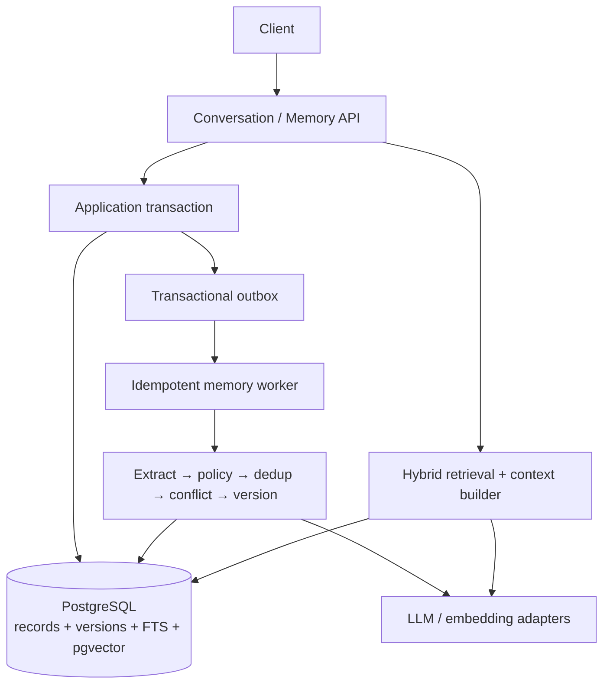

# MemOS

> Production-grade long-term memory infrastructure for AI agents.

MemOS studies a deceptively hard production question: **how should a long-running AI agent decide what to remember, preserve the history of changing facts, retrieve only useful evidence, forget safely, and prove that the result is better than simpler baselines?**

This repository is deliberately not an `Embedding + Vector DB + TopK` demo. Its target is a versioned, temporal, observable, privacy-aware memory subsystem whose write path, read path, consistency model, failure recovery, and benchmark results can be defended in a backend-system-design interview.

## Current status

Phase 1 — research, problem definition, architecture selection, and benchmark planning — is complete and published to [GitHub](https://github.com/Zhi-Xiang-Guo/memos). Features 0–5 are published. Feature 5 authentication, RBAC, governed erasure, content-safe audit, and poisoning-boundary work is remotely verified through commit `ae37714` and [GitHub Actions run #22](https://github.com/Zhi-Xiang-Guo/memos/actions/runs/33272314267). There is **no formal benchmark result yet**. Deterministic fixture values validate policy mechanics only, and any formal result table must be generated from a reproducible run manifest.

- Research: `DONE`
- Architecture: `DONE` (ADRs 0001–0004 remain `PROPOSED`; the narrower Feature 5 implementation gate accepted ADR-0005)
- MVP implementation: `DOING` — Features 0–5 are `DONE / PUBLISHED`; Feature 6's workload and
  smoke contract are frozen, while harness execution remains `NOT RUN`
- Benchmark research/protocol: `DONE`
- Benchmark execution: `TODO` / `NOT RUN`
- Initial repository and Features 0–4 publication: `DONE`

See [progress](docs/progress.md), [open questions](docs/open-questions.md), and [benchmark results](docs/benchmark/results.md).

## Motivation

Long-running agents turn small memory mistakes into recurring product failures: noise becomes durable state, stale facts outrank corrections, sensitive content survives in side stores, and one poisoned instruction can influence later sessions. A credible memory layer therefore needs lifecycle semantics, failure recovery, governance, and measurement—not only a convenient retrieval API.

MemOS is also intentionally an evidence-driven backend project. Every architectural claim must be traceable to primary research, a pinned source path, or a future repository-local experiment; performance and quality numbers remain absent until a reproducible benchmark generates them.

## Problem

A retained conversation log is an append-only account of what was said. A useful memory is a selected and governed piece of state derived from evidence. The distinction matters:

- most messages are noise and should never become long-term state;
- semantically similar text may describe different times, entities, or truth states;
- a new fact may supersede an old fact without erasing history;
- retrieval similarity does not determine whether a fact is current, authorized, trustworthy, or safe to inject;
- deletion must cover the source of truth, derived indexes, caches, jobs, and audit policy;
- an incorrect write can contaminate many future agent decisions.

## Memory Lifecycle

MemOS therefore treats memory as a lifecycle:


## Architecture

The current recommendation is a **Java modular monolith with an asynchronous memory worker and PostgreSQL as the source of truth**:

- Java 25 LTS and Spring Boot 4.1.1 in a Maven multi-module build;
- PostgreSQL for transactional state, temporal/version records, audit data, full-text search, and job/outbox coordination;
- `pgvector` as a derived semantic index, not the authority for memory truth;
- a transactional outbox and idempotent worker for at-least-once extraction;
- hybrid candidate retrieval over semantic, lexical, entity/metadata, and temporal signals; importance and recency remain benchmark ablations rather than selected ranking inputs;
- ports for LLM, embedding, reranker, and vector-store providers;
- no Kafka, Redis, OpenSearch, graph database, or dedicated vector database until a measured bottleneck justifies one.



The decision and alternatives are documented in [architecture candidates](docs/architecture/02-architecture-candidates.md), [recommended architecture](docs/architecture/03-recommended-architecture.md), and the [ADRs](docs/adr/README.md).

## Retrieval

Retrieval begins with hard tenant/user/agent and sensitivity filters, then independently generates semantic, lexical, entity/metadata, and temporal candidates. The initial experiment fuses ranks with RRF, applies current/historical/conflict policy, optionally reranks behind a deadline, and selects diverse provenance-bearing evidence under a tokenizer-measured budget. Importance and recency remain explicit ablations; the benchmark—not prose—selects weights, K, thresholds, and rerankers.

See the complete [read pipeline](docs/architecture/03-recommended-architecture.md#read-pipeline) and [retrieval evaluation protocol](docs/benchmark/plan.md#retrieval).

## Memory contract

The initial model distinguishes:

- **Working memory** — task-local state with short retention.
- **Semantic memory** — comparatively stable facts, preferences, and project constraints.
- **Episodic memory** — time-bound events and decisions.
- **Procedural memory** — reusable, evidence-backed behavioral rules.

Entity, relationship, and task memory remain optional projections until benchmark cases demonstrate that they add value. Every persisted memory must carry tenant and user scope, provenance, confidence, event/valid time, version, and a truth status such as `CURRENT`, `HISTORICAL`, `CONFLICTED`, or `INVALIDATED`.

## Benchmark

MemOS will compare four systems under the same dataset, model snapshot, prompt, and run manifest:

1. full conversation context;
2. rolling conversation summary;
3. pure vector search;
4. MemOS.

Coverage includes simple and multi-session recall, preference recall, update, temporal reasoning, contradiction resolution, multi-hop questions, abstention, long-term retention, and noise. Retrieval and answer quality are measured separately, alongside latency, token use, storage growth, and write cost. See the [benchmark plan](docs/benchmark/plan.md).

## Technology Choices

- **Java 25.0.4.1 LTS / Spring Boot 4.1.1 / Maven 3.9.16** for the production domain and separate API/worker artifacts.
- **PostgreSQL + pgvector + FTS** for one transactional authority and rebuildable semantic/lexical projections.
- **Python** only for portable benchmark adapters and analysis, not a second implementation of truth semantics.
- **Provider ports** for LLM, embedding, and reranking so model choice does not own the domain.
- **No Kafka, Redis, OpenSearch, graph database, or dedicated vector store in the MVP** until a measured trigger justifies the new consistency boundary.

## Trade-offs

- Asynchronous formation removes model latency from ordinary chat but creates observable freshness lag.
- One PostgreSQL boundary simplifies atomicity, deletion, and local reproduction but may later create OLTP/search contention.
- Append-only assertions and state transitions preserve retained history but make lifecycle queries and governed erasure more complex.
- Hybrid retrieval covers complementary query types but adds tuning and latency; it must beat vector-only under equal budgets.
- Java strengthens the backend implementation boundary while Python preserves evaluation ergonomics; a multi-language repository adds tooling cost.
- Deferring specialized infrastructure reduces failure modes now and postpones extreme-scale claims until a workload exists.

## Research map

- [半年学习、项目深化与面试路线](docs/learning-roadmap.md)
- [Memory landscape](docs/research/01-memory-landscape.md)
- [Mem0](docs/research/02-mem0-analysis.md)
- [MemGPT / Letta](docs/research/03-memgpt-letta-analysis.md)
- [LangGraph](docs/research/04-langgraph-analysis.md)
- [Zep / Graphiti](docs/research/05-zep-analysis.md)
- [Benchmarks](docs/research/06-memory-benchmark-analysis.md)
- [Design lessons](docs/research/07-memory-design-lessons.md)
- [Competitive matrix](docs/research/08-competitive-matrix.md)
- [Pinned source analysis](docs/source-analysis/README.md)

## Quick Start

Prerequisites are Git, a Java 25 JDK, and a Docker-compatible runtime with Compose. The Maven Wrapper and deterministic fake providers mean no system Maven or paid model credential is required.

```bash
cp .env.example .env
docker compose up -d --wait postgres
./mvnw -B -ntp clean verify
./scripts/smoke.sh
```

The API listens on `8080`, the worker management endpoint on `8081`, and both expose `/livez` and `/readyz`. Liveness excludes the database; readiness includes it. To verify the separate benchmark workspace:

```bash
cd benchmark
uv sync --locked --python 3.14.7
uv run ruff format --check .
uv run ruff check .
uv run pytest
```

See the [Feature 0 implementation note](docs/implementation/feature-0.md) for the module graph, pinned toolchain, local profiles, migration behavior, and operational caveats.

To review the design before running it:

1. Read the [problem definition](docs/architecture/01-problem-definition.md).
2. Review the [competitive matrix](docs/research/08-competitive-matrix.md).
3. Challenge the [recommended architecture](docs/architecture/03-recommended-architecture.md) against the alternatives.
4. Inspect the [MVP plan](docs/architecture/04-mvp-plan.md) and [open questions](docs/open-questions.md).

Feature 1 provides the first business API. The current runtime derives tenant/user/agent scope only from a verified bearer token. Generate a short-lived local token before calling a business endpoint:

```bash
token=$(python3 scripts/generate-dev-jwt.py \
  --tenant tenant-a --user user-a --agent agent-a \
  --subject local-user-a --role USER)

curl --request POST http://localhost:8080/v1/source-events \
  --header 'Content-Type: application/json' \
  --header 'Idempotency-Key: message-123' \
  --header "Authorization: Bearer $token" \
  --data '{
    "sourceId":"message-123",
    "sessionId":"session-a",
    "actorType":"USER",
    "sourceType":"CONVERSATION_MESSAGE",
    "trustLevel":"DIRECT_USER",
    "occurredAt":"2026-08-27T00:00:00Z",
    "payload":{"content":"I prefer concise answers."}
  }'
```

The `202 Accepted` receipt contains stable source-event and materialization-job IDs. Inspect the
entire extraction-to-projection chain with
`GET /v1/source-events/{sourceEventId}/materialization`, inspect one job with
`GET /v1/materialization-jobs/{jobId}`, or explicitly replay eligible incomplete work with
`POST /v1/materialization-jobs/{jobId}/replay`. All three use the same bearer token and hard scope.
See the [Feature 1 implementation note](docs/implementation/feature-1.md) for conflict, lease, and
failure semantics.

Feature 2 replaces the no-op worker effect with structured candidate extraction. The credential-free default fake recognizes one stable local example (`I prefer a dark editor theme.`) and safely returns no candidates for unknown content; it exists to verify plumbing, not model quality. Set `MEMOS_EXTRACTION_PROVIDER=openai-compatible` only with an explicit base URL, fixed model snapshot, API key, and timeout. Regardless of provider, strict application code validates `memory-candidate.v1`, computes trust/sensitivity/write policy, and erases rejected or review proposal content before persistence. See the [Feature 2 implementation note](docs/implementation/feature-2.md).

Feature 3 consumes accepted candidates into a PostgreSQL authority with stable lineages, immutable retained assertion versions, append-only state transitions, source/run/candidate provenance, a rebuildable current-state projection, and a durable `PROJECTION_BUILD` intent for Feature 4. `GET /v1/memories` and its inspect/history/current/as-of/diff variants are hard-scoped by tenant/user/agent. Correction and invalidation require existing governed evidence, an idempotency key, and a strong numeric `If-Match` lock version. See the [Feature 3 implementation note](docs/implementation/feature-3.md).

Feature 4 asynchronously turns the latest authoritative transition into a rebuildable pgvector/FTS projection, then exposes `POST /v1/retrieval` for hybrid evidence and token-budgeted context. `POST /v1/retrieval/trace` exposes component diagnostics only to a verified `OPERATOR` role and writes a content-safe access audit. The default hashing embedding validates local plumbing only. See the [Feature 4 implementation note](docs/implementation/feature-4.md).

Feature 5 replaces forgeable scope headers and the temporary operator key with signed JWT claim validation and `USER`, `OPERATOR`, and `PRIVACY_ADMIN` roles. It adds memory/user erasure workflows, immediate projection hiding, lease-fenced retry/dead/requeue processing, opaque append-only tombstones, replay/resurrection guards, and a deterministic hostile-memory rendering fixture. The local HS256 secret is a development/reference mode, not a production identity-provider or key-rotation claim. See the [Feature 5 implementation note](docs/implementation/feature-5.md).

Feature 6 has frozen a versioned, synthetic bilingual personal/project-assistant smoke dataset,
license/attribution boundary, prompt and content hashes, four-baseline parity contract, and exact
local Ollama model IDs. Its bounded Ollama client, strict answer/summary schemas, and three
non-MemOS baseline context builders are published. A bounded authenticated MemOS client now waits
on observable source-level materialization state instead of sleeping for a guessed duration; that
path is remotely verified through commit `2bf7689` and GitHub Actions run `#30`. The unified runner
and every baseline score remain incomplete. Java projection/retrieval now use the same
digest-pinned 1024-dimensional Ollama model contract and renew leases across slow provider calls
and serial claimed batches; commit `9225ed1` and
[GitHub Actions run #32](https://github.com/Zhi-Xiang-Guo/memos/actions/runs/33279370001)
remotely verify the PostgreSQL migration, renewal, and compose paths. Populated deployments still
need an explicit model-version projection reconciliation path. See the
[Feature 6 implementation note](docs/implementation/feature-6.md).

## Design principles

- Evidence and interpretations are append-only while retained; corrections add records, while policy/legal erasure may remove content and leave only a non-content tombstone.
- Retrieval indexes are rebuildable projections, not the source of truth.
- Memory writes are idempotent, attributable, and observable.
- “Current” and “historical” are explicit temporal semantics, not vector-score side effects.
- Sensitive data is rejected or governed before persistence, not merely hidden at read time.
- Quality claims require baselines, ablations, costs, and reproducible artifacts.
- Infrastructure is introduced after measurement, not for résumé decoration.

## Roadmap

`Research → Problem Definition → Competitor Analysis → Architecture → MVP → Advanced Memory → Evaluation → Optimization → Documentation → Resume → Interview Preparation`

Each feature remains a separately tested, documented, committed, and pushed unit. The active project goal authorizes Features 0–6 without a new phase prompt.
