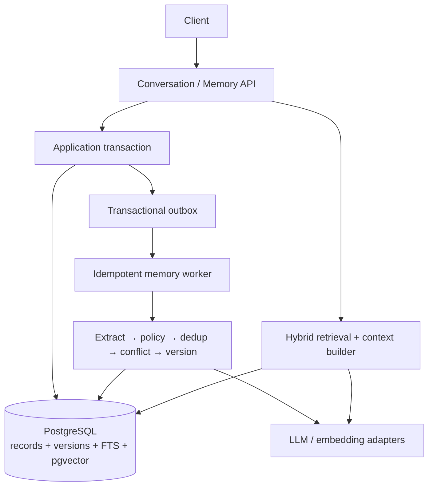

# MemOS

> Production-grade long-term memory infrastructure for AI agents.

MemOS studies a deceptively hard production question: **how should a long-running AI agent decide what to remember, preserve the history of changing facts, retrieve only useful evidence, forget safely, and prove that the result is better than simpler baselines?**

This repository is deliberately not an `Embedding + Vector DB + TopK` demo. Its target is a versioned, temporal, observable, privacy-aware memory subsystem whose write path, read path, consistency model, failure recovery, and benchmark results can be defended in a backend-system-design interview.

## Current status

Phase 1 — research, problem definition, architecture selection, and benchmark planning — is complete and published to [GitHub](https://github.com/Zhi-Xiang-Guo/memos). There is **no runnable MVP and no benchmark result yet**. Any result table that appears later must be generated from a reproducible run manifest; placeholder numbers are forbidden.

- Research: `DONE`
- Architecture: `DONE` (ADRs remain `PROPOSED` until implementation validates them)
- MVP implementation: `TODO`
- Benchmark research/protocol: `DONE`
- Benchmark execution: `TODO` / `NOT RUN`
- GitHub publication: `DONE`

See [progress](docs/progress.md), [open questions](docs/open-questions.md), and [benchmark results](docs/benchmark/results.md).

## Motivation

Long-running agents turn small memory mistakes into recurring product failures: noise becomes durable state, stale facts outrank corrections, sensitive content survives in side stores, and one poisoned instruction can influence later sessions. A credible memory layer therefore needs lifecycle semantics, failure recovery, governance, and measurement—not only a convenient retrieval API.

MemOS is also intentionally an evidence-driven backend project. Every architectural claim must be traceable to primary research, a pinned source path, or a future repository-local experiment; performance and quality numbers remain absent until a reproducible benchmark generates them.

## Problem

A retained conversation log is an append-only account of what was said. A useful memory is a selected and governed piece of state derived from evidence. The distinction matters:

- most messages are noise and should never become long-term state;
- semantically similar text may describe different times, entities, or truth states;
- a new fact may supersede an old fact without erasing history;
- retrieval similarity does not determine whether a fact is current, authorized, trustworthy, or safe to inject;
- deletion must cover the source of truth, derived indexes, caches, jobs, and audit policy;
- an incorrect write can contaminate many future agent decisions.

## Memory Lifecycle

MemOS therefore treats memory as a lifecycle:

## Architecture

The current recommendation is a **Java modular monolith with an asynchronous memory worker and PostgreSQL as the source of truth**:

- Java 21+ and Spring Boot, with exact versions pinned when implementation starts;
- PostgreSQL for transactional state, temporal/version records, audit data, full-text search, and job/outbox coordination;
- `pgvector` as a derived semantic index, not the authority for memory truth;
- a transactional outbox and idempotent worker for at-least-once extraction;
- hybrid candidate retrieval over semantic, lexical, entity/metadata, and temporal signals; importance and recency remain benchmark ablations rather than selected ranking inputs;
- ports for LLM, embedding, reranker, and vector-store providers;
- no Kafka, Redis, OpenSearch, graph database, or dedicated vector database until a measured bottleneck justifies one.

The decision and alternatives are documented in [architecture candidates](docs/architecture/02-architecture-candidates.md), [recommended architecture](docs/architecture/03-recommended-architecture.md), and the [ADRs](docs/adr/README.md).

## Retrieval

Retrieval begins with hard tenant/user/agent and sensitivity filters, then independently generates semantic, lexical, entity/metadata, and temporal candidates. The initial experiment fuses ranks with RRF, applies current/historical/conflict policy, optionally reranks behind a deadline, and selects diverse provenance-bearing evidence under a tokenizer-measured budget. Importance and recency remain explicit ablations; the benchmark—not prose—selects weights, K, thresholds, and rerankers.

See the complete [read pipeline](docs/architecture/03-recommended-architecture.md#read-pipeline) and [retrieval evaluation protocol](docs/benchmark/plan.md#retrieval).

## Memory contract

The initial model distinguishes:

- **Working memory** — task-local state with short retention.
- **Semantic memory** — comparatively stable facts, preferences, and project constraints.
- **Episodic memory** — time-bound events and decisions.
- **Procedural memory** — reusable, evidence-backed behavioral rules.

Entity, relationship, and task memory remain optional projections until benchmark cases demonstrate that they add value. Every persisted memory must carry tenant and user scope, provenance, confidence, event/valid time, version, and a truth status such as `CURRENT`, `HISTORICAL`, `CONFLICTED`, or `INVALIDATED`.

## Benchmark

MemOS will compare four systems under the same dataset, model snapshot, prompt, and run manifest:

1. full conversation context;
2. rolling conversation summary;
3. pure vector search;
4. MemOS.

Coverage includes simple and multi-session recall, preference recall, update, temporal reasoning, contradiction resolution, multi-hop questions, abstention, long-term retention, and noise. Retrieval and answer quality are measured separately, alongside latency, token use, storage growth, and write cost. See the [benchmark plan](docs/benchmark/plan.md).

## Technology Choices

- **Java/Spring Boot** for the production domain and API/worker roles; exact versions are pinned only when Feature 0 begins.
- **PostgreSQL + pgvector + FTS** for one transactional authority and rebuildable semantic/lexical projections.
- **Python** only for portable benchmark adapters and analysis, not a second implementation of truth semantics.
- **Provider ports** for LLM, embedding, and reranking so model choice does not own the domain.
- **No Kafka, Redis, OpenSearch, graph database, or dedicated vector store in the MVP** until a measured trigger justifies the new consistency boundary.

## Trade-offs

- Asynchronous formation removes model latency from ordinary chat but creates observable freshness lag.
- One PostgreSQL boundary simplifies atomicity, deletion, and local reproduction but may later create OLTP/search contention.
- Append-only assertions and state transitions preserve retained history but make lifecycle queries and governed erasure more complex.
- Hybrid retrieval covers complementary query types but adds tuning and latency; it must beat vector-only under equal budgets.
- Java strengthens the backend implementation boundary while Python preserves evaluation ergonomics; a multi-language repository adds tooling cost.
- Deferring specialized infrastructure reduces failure modes now and postpones extreme-scale claims until a workload exists.

## Research map

- [Memory landscape](docs/research/01-memory-landscape.md)
- [Mem0](docs/research/02-mem0-analysis.md)
- [MemGPT / Letta](docs/research/03-memgpt-letta-analysis.md)
- [LangGraph](docs/research/04-langgraph-analysis.md)
- [Zep / Graphiti](docs/research/05-zep-analysis.md)
- [Benchmarks](docs/research/06-memory-benchmark-analysis.md)
- [Design lessons](docs/research/07-memory-design-lessons.md)
- [Competitive matrix](docs/research/08-competitive-matrix.md)
- [Pinned source analysis](docs/source-analysis/README.md)

## Quick Start

There is intentionally no application quick start in Phase 1. To review the project today:

1. Read the [problem definition](docs/architecture/01-problem-definition.md).
2. Review the [competitive matrix](docs/research/08-competitive-matrix.md).
3. Challenge the [recommended architecture](docs/architecture/03-recommended-architecture.md) against the alternatives.
4. Inspect the [MVP plan](docs/architecture/04-mvp-plan.md) and [open questions](docs/open-questions.md).

Runnable local infrastructure, API examples, migrations, and reproducible benchmark commands will be added only when the MVP phase begins.

## Design principles

- Evidence and interpretations are append-only while retained; corrections add records, while policy/legal erasure may remove content and leave only a non-content tombstone.
- Retrieval indexes are rebuildable projections, not the source of truth.
- Memory writes are idempotent, attributable, and observable.
- “Current” and “historical” are explicit temporal semantics, not vector-score side effects.
- Sensitive data is rejected or governed before persistence, not merely hidden at read time.
- Quality claims require baselines, ablations, costs, and reproducible artifacts.
- Infrastructure is introduced after measurement, not for résumé decoration.

## Roadmap

`Research → Problem Definition → Competitor Analysis → Architecture → MVP → Advanced Memory → Evaluation → Optimization → Documentation → Resume → Interview Preparation`

The repository stops at each phase boundary for review. Phase 1 does not authorize large-scale coding.
