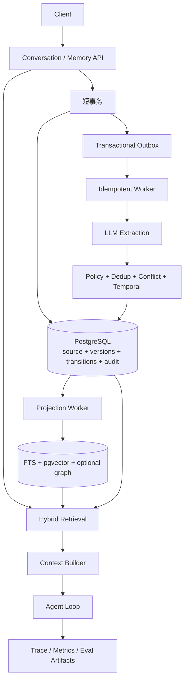
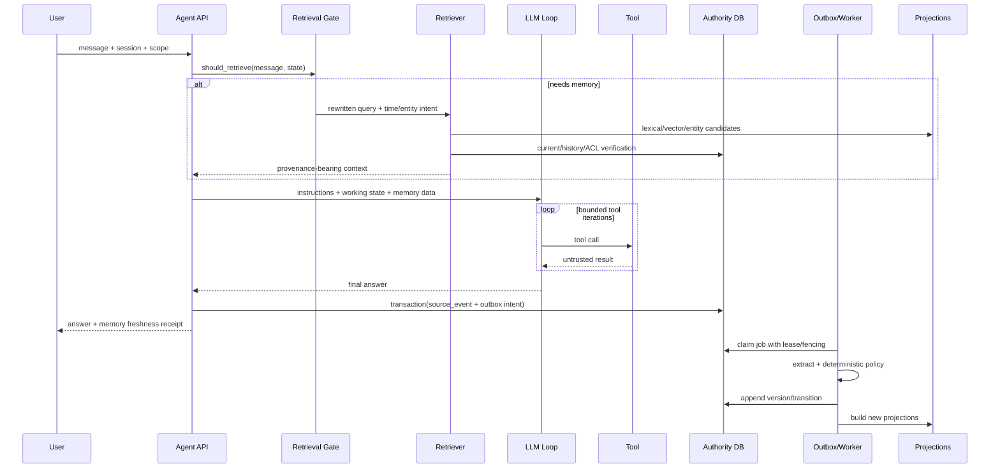

# 02 一次完整 Agent 运行与架构

## 本章导学

**学习目标**：从一次请求出发，掌握在线读路径、Agent loop、异步写路径和后台维护如何协作，并明确每个组件的输入、输出、SLO 和失败语义。

**前置知识**：第 00-01 章；了解 API、数据库事务和消息队列的基本概念更佳。

**读完产出**：一张可实现的时序图、一组 API contract、一个 trace 树和一份故障降级表。

## 1. 先分清三条路径

生产 Memory 不是一个 `memory.search()` 调用，而是三条相互配合的路径：

```text
Write:  experience -> candidate -> policy -> versioned truth -> indexes
Read:   query -> gate -> candidates -> fusion -> policy -> context -> answer
Manage: history + current state -> consolidate/retire/reflect/delete/reindex
```

写、读、维护可以使用不同模型、不同延迟目标和不同一致性语义。

## 2. 一次完整 Agent run

### 步骤 1：接收事件并建立 trace

系统为 run 生成 `run_id` / `trace_id`，记录 tenant、user、agent、session 和请求版本。原始内容不应默认出现在日志或 trace 中。

### 步骤 2：构建短期工作上下文

装配 system/developer instructions、SOUL、匹配的 Skills、最近对话、任务状态。此时尚未必访问长期记忆。

### 步骤 3：Retrieval Gate

判断当前消息是否需要长期记忆，并可生成更适合搜索的 query：

```json
{"retrieve": true, "query": "Elon arrival time current", "reason": "personal schedule"}
```

设计要点：

- 规则可直接识别 `remember/以前/上次/我的/何时见` 等信号。
- 小模型处理隐式引用和 query rewrite。
- gate 失败时是 fail-open 还是 fail-closed，要按风险选择。
- 记录 gate latency、decision、reason，但避免记录敏感原文。

### 步骤 4：多路候选召回

在硬 scope/ACL/sensitivity 过滤下，独立生成候选：

- lexical/FTS：名字、金额、ID、精确短语；
- vector：改写、语义、跨语言；
- entity/metadata：subject、predicate、memory type；
- temporal：current/as-of/change interval；
- graph：关系和多跳邻居。

不能先取 vector TopK，再只在这 K 条里找关键词或实体；那会让 vector 成为其他检索器的召回上限。

### 步骤 5：融合与 rerank

先用 RRF 等低假设方法融合各路 rank，再可选 cross-encoder/LLM reranker。reranker 必须有 deadline、返回 ID 校验和确定性 fallback。

### 步骤 6：Truth/Authorization Policy

排序后仍需处理：

- 当前问题是否允许历史版本；
- superseded/invalidated 是否排除；
- unresolved conflict 是同时提供两边还是要求 abstain；
- 当前 actor 是否可读；
- provenance 是否满足信任要求。

这些属于应用策略，不能交给 embedding 或 reranker 决定。

### 步骤 7：Context Builder

把记忆渲染为受限、带来源的“数据”，而不是 system 指令：

```xml
<memory id="m2" status="CURRENT" valid_from="2026-08-29T13:00:00Z">
  Elon will arrive at 9 PM.
</memory>
```

按最终序列化文本计算 token；做去重、多样性、冲突组原子选择和预算截断。证据不足时明确 `insufficient`，不强行塞一条最相似结果。

### 步骤 8：Agent Loop 与工具调用

```text
while not done and iterations < max_iterations:
    response = llm(context, tools)
    if response requests tools:
        results = execute_with_policy(tool_calls)
        context += results
    else:
        return response
```

工具结果属于当前 working memory；是否进入长期记忆，要经过独立 write path。外部网页或工具输出不能直接写成可信用户偏好或程序性规则。

### 步骤 9：保存事件并异步形成长期记忆

普通聊天路径优先原子提交 `source_event + outbox_job` 后返回。后台 worker：

```text
claim job
-> LLM structured extraction
-> schema validation
-> trust/sensitivity/write policy
-> dedup/conflict/temporal decision
-> append version + transition
-> enqueue projection build
```

这样把昂贵、易失败的模型调用移出请求关键路径，同时用幂等、lease/fencing 和重试保证不静默丢失。

### 步骤 10：Consolidation / Reflection

达到 N 个未整理事件、一个任务结束、定时窗口或质量触发器后，对局部或全局记忆进行合并、去重、冲突检查和洞察提取。产物仍需通过 policy，不能让模型任意改写权威状态。

## 3. 组件边界

| 组件 | 负责 | 不负责 |
|---|---|---|
| Source store | 保存可追溯原始事件 | 决定长期真值 |
| Extractor | 提议事实/事件/规则 | 授权和删除 |
| Write policy | 信任、敏感、是否可写 | 语义理解全部细节 |
| Temporal authority | 版本、状态、有效时间 | 高效语义相似搜索 |
| Projection worker | 构建 FTS/vector/graph | 反向修改权威真值 |
| Retriever | 高召回候选 | 最终真值判断 |
| Reranker | 优化候选顺序 | 绕过 ACL/truth filter |
| Context builder | 预算、去重、安全渲染 | 改写来源事实 |
| Reflector/Dreamer | 后台综合和清理建议 | 无审计地覆盖输入 |

## 4. 推荐生产架构



MVP 优先单 PostgreSQL 边界：权威表、outbox、FTS、pgvector 共处，减少 dual-write 和删除一致性问题。Kafka、Redis、OpenSearch、专用向量库、图数据库应在可测瓶颈出现后再引入。

## 5. Tracing 应看到什么

建议 span 树：

```text
agent.run
  context.assemble
  memory.gate
  memory.retrieve
    retrieve.lexical
    retrieve.vector
    retrieve.temporal
    fuse.rrf
    rerank.optional
    context.select
  llm.iteration.1
  tool.execute
  llm.iteration.2
  memory.source.commit
```

关键字段：版本、候选数、过滤数、rank、状态、watermark、token、延迟、模型调用、fallback 原因。敏感正文默认不写入 trace。

## 6. 一致性与失败语义

- **写入新鲜度**：异步形成意味着 source 已收但 memory 尚不可查；API 应暴露 job/projection watermark。
- **至少一次处理**：worker 可能重复执行，领域效果必须幂等。
- **投影可滞后**：权威状态已更新而 vector 尚未重建；不能把旧投影当真值。
- **Gate/Reranker 降级**：错误或超时走显式 fallback，并记录原因。
- **模型输出不可信**：structured output 通过 schema 仍不等于授权、真实或安全。

## 7. 学完本章应能回答

- 一次 Agent run 中 retrieval gate 在哪里，为什么不是每轮都检索？
- 工具结果为什么不能直接成为长期记忆？
- 为什么模型调用应在数据库事务外？
- 如何区分“记忆没写入”“索引没刷新”“召回没命中”“LLM 没使用”？

## 8. 端到端时序图



关键设计：在线回答可以先于长期 memory materialization 完成，但必须让调用方知道这是 eventual freshness；若产品要求“我刚说记住，下一句立即能用”，可在 working/session state 中 read-your-writes，或同步形成一条受限 provisional memory，再异步治理。

## 9. API Contract 示例

### 接收 source event

```http
POST /v1/source-events
Idempotency-Key: msg-123
X-Tenant-Id: tenant-a
X-User-Id: user-a
X-Agent-Id: agent-a
Content-Type: application/json

{
  "sourceId": "message-123",
  "sessionId": "session-9",
  "actorType": "USER",
  "sourceType": "CONVERSATION_MESSAGE",
  "occurredAt": "2026-08-29T12:00:00Z",
  "payload": {"content": "Elon changed arrival to 9 PM."}
}
```

```json
{
  "sourceEventId": "evt_...",
  "materializationJobId": "job_...",
  "status": "ACCEPTED",
  "consistency": "EVENTUAL"
}
```

### 查询记忆

```http
POST /v1/memory/query
```

```json
{
  "query": "Elon 几点到？",
  "timeIntent": "CURRENT",
  "memoryTypes": ["SEMANTIC", "EPISODIC"],
  "maxEvidenceTokens": 1200,
  "includeProvenance": true
}
```

响应除结果外应包含 `authorityVersion`、`projectionGeneration`、`freshThrough` 和 fallback 信息，使“查不到”可以区分没有数据、投影滞后和策略过滤。

## 10. Retrieval Gate 的策略与评估

Gate 有三种实现：

| 实现 | 优点 | 缺点 | 适用 |
|---|---|---|---|
| 规则 | 快、确定、可审计 | 召回有限 | 明确关键词/命令 |
| 小模型 | 理解隐式指代 | 延迟、成本、非确定 | 自然对话 |
| 规则 + 模型 | 常见 case 快，复杂 case 灵活 | 两套逻辑 | 生产推荐起点 |

Gate 需要单独标注集：`needs_memory`、期望 query、实体、时间意图。指标不能只看 accuracy；假阴性会完全阻断 recall，通常比假阳性更严重。可报告 recall、precision、额外检索率和由 gate 导致的 answer delta。

fail-open/closed 取决于场景：个人助手 gate 出错时可检索以保体验；高敏场景不能用“检索总比丢失好”作为通用原则，授权未知应 fail-closed。

## 11. 写入 Job 状态机

```text
PENDING -> CLAIMED -> EXTRACTING -> COMMITTING -> COMPLETED
              |           |             |
              +-------> RETRYABLE <-----+
                              |
                              -> DEAD -> explicit REPLAY
```

状态字段建议包含：attempt、max_attempts、next_attempt_at、lease_until、fencing_token、provider_request_id、error_code、schema/model/policy version。错误信息不保存 raw memory 正文。

### Exactly-once 的诚实边界

- source + outbox intent：数据库事务内 exactly-once-visible（依赖唯一键）。
- provider 调用：网络超时后无法知道对方是否处理，不能保证只调用一次。
- authority effect：用 semantic key/effect ledger 做逻辑幂等。
- projection：允许重复构建，但 generation/head 切换必须单调。

## 12. Read-your-writes、强一致与最终一致

| 方案 | 用户体验 | 延迟 | 复杂度 |
|---|---|---|---|
| 同步全形成 | 下一轮立即可查 | 高且受模型影响 | 中 |
| working-state overlay | 当前 session 立即可用，后台持久化 | 低 | 中 |
| 全异步 | 快速响应 | 有 freshness 窗口 | 低-中 |
| 权威直读 fallback | projection 落后时查结构化 current | 中 | 高 |

不要口头说“实时记忆”。定义 SLO，例如 source accepted、authority materialized、projection queryable 各自 p95，并暴露 watermark。

## 13. 动手练习与验收

### 练习

为“记住用户把会议从周二改到周三”画出：在线回答、source commit、worker retry、version transition、projection build 和下一次 current query 的完整时序。插入三个崩溃点并说明恢复结果。

### 本章验收

- 能解释 read/write/manage 为什么是三条路径。
- 能给 Retrieval Gate 定义可测的 precision/recall。
- 能说清 provider 调用与 authority effect 的 exactly-once 边界。
- 能为 read-your-writes 选择一种方案并说明代价。
- 能从 trace 定位写入、freshness、召回、上下文或生成错误。
