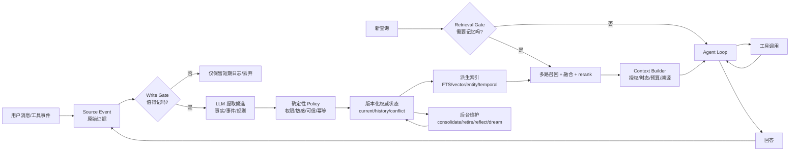

# Agent Memory 0-1 学习笔记

> 目标：从“LLM 每次调用为什么会失忆”出发，最终具备独立设计、实现、评估和讲解生产级 Agent Memory 系统的能力，并把它做成一年社招可深挖的主力项目。

研究截止：2026-08-29。快速变化的产品能力以 `12-资料与事实边界.md` 标注的官方资料和本地固定源码为准。

## 内容格式

全套笔记按一个统一问题链展开：

```text
背景/要解决的问题
-> 第一性原理
-> 整体架构与端到端流程
-> 分层实现与技术栈
-> 前沿机制
-> 实验、失败和适用边界
-> 一年项目与社招输出
```

## 先记住一句话

**Agent Memory 不是向量数据库，也不是聊天记录；它是从可追溯经验中形成、治理、演化，并在未来任务中按需重建进工作上下文的持久状态。**

这句话包含四条主线：

1. **背景 / 解决什么问题**：无状态调用、有限上下文、跨会话连续性、事实更新、个性化与长期任务。
2. **第一性原理**：模型参数、上下文窗口和外部持久状态是三种不同东西；存储、检索、治理也必须分开。
3. **整体架构流程**：`事件 -> 候选提取 -> 写入策略 -> 版本化权威状态 -> 派生索引 -> 混合召回 -> 上下文构建 -> Agent`。
4. **前沿知识与技术栈**：Embedding、Vector RAG、Agentic RAG、Graph RAG、Temporal Graph、Reflect/Dreaming、混合检索、评估、安全与微调。

## 学习顺序

| 阶段 | 目标 | 建议章节 | 可验证产出 |
|---|---|---|---|
| L0 直觉 | 能解释为什么会失忆、什么才算记忆 | 00-02 | 画出一次 Agent run |
| L1 MVP | 能写跨会话文本/SQLite 记忆 | 03-05 | `MEMORY.md + SQLite FTS5` |
| L2 检索 | 能做 Embedding、向量/混合召回和 rerank | 04、06 | vector-only 与 hybrid 对照 |
| L3 治理 | 能处理更新、冲突、时间、删除、溯源 | 05、08 | 7 点改 9 点不返回旧值 |
| L4 前沿 | 能判断 Graph、Zep、mem0、LangMem、Dreaming 的边界 | 06、09 | 技术选型 ADR |
| L5 社招输出 | 能用实验和数据证明项目价值 | 07、08、10 | benchmark、README、面试故事 |

## 怎么使用这套笔记

### 第一遍：建立全局地图（1-2 天）

阅读 README、00、01、02、03、13。目标不是记细节，而是能画出：

```text
LLM/context/state 边界
write/manage/read 三条路径
shape/find/manage 三个支柱
五层存储阶梯
```

### 第二遍：实现最小闭环（2-4 周）

阅读 02、03、05、07，在本地实现 `SQLite + FTS5 + source log + consolidation + current/historical`。先跑 control 与 exact/update case，不接五个供应商。

### 第三遍：建立检索与评估能力（4-8 周）

阅读 04、06、07、08，加入 pgvector/hybrid/RRF，构造中英、旧值、同名实体、拒答 hard negatives。要求每个错误可定位到具体层。

### 第四遍：生产与社招深化（持续）

阅读 05、08、09、10、12，完成异步可靠性、删除/投毒、模型升级、正式 benchmark 和 Evidence Ledger。

## 每章统一学习法

1. 先读“本章导学”，明确产出。
2. 自己画机制图/状态机，再对照正文。
3. 运行或实现最小案例，不把阅读当掌握。
4. 主动构造一个反例击穿简单方案。
5. 完成章末练习和验收；答不出就回到对应机制。
6. 把确认事实、工程推断、待实验假设分开记录。

## 两条并行主线

| 主线 | 关注 | 最终能力 |
|---|---|---|
| AI/检索 | extraction、embedding、RAG、rerank、graph、fine-tuning | 提升召回与回答效用 |
| 后端/治理 | authority、time、transaction、idempotency、ACL、delete、observability | 保证状态正确与可运营 |

真正有亮点的 Agent Memory 项目必须把两条线接起来。只会 AI API，无法解释状态；只会后端 CRUD，又无法证明检索/下游质量。

## 文件导航

- [00-背景与第一性原理.md](00-背景与第一性原理.md)：从无状态 LLM 到受治理的持久状态。
- [01-记忆分类与三支柱.md](01-记忆分类与三支柱.md)：程序性、语义、情节记忆；形态、检索、维护三支柱。
- [02-一次完整Agent运行与架构.md](02-一次完整Agent运行与架构.md)：检索门、工具循环、写路径、tracing。
- [03-五层存储阶梯.md](03-五层存储阶梯.md)：纯文本、SQLite、向量库、mem0、Zep；LangMem 的真实位置。
- [04-Embedding-向量RAG与召回.md](04-Embedding-向量RAG与召回.md)：chunk、embedding、ANN、混合检索、rerank、指标。
- [05-记忆维护-版本-时序与Dreaming.md](05-记忆维护-版本-时序与Dreaming.md)：增删改、retire、溯源、reflect、consolidation、dreaming。
- [06-RAG-AgenticRAG-GraphRAG.md](06-RAG-AgenticRAG-GraphRAG.md)：三类 RAG 的机制、边界和何时不用。
- [07-晚宴实验与memory-native实操.md](07-晚宴实验与memory-native实操.md)：五个存储同事实对照、中文召回、事实纠正。
- [08-评估-可观测性-安全与生产化.md](08-评估-可观测性-安全与生产化.md)：benchmark、tracing、多租户、隐私、删除、防投毒。
- [09-微调与前沿进阶.md](09-微调与前沿进阶.md)：记忆/RAG/微调边界、Self-RAG、长期反思、学习型策略。
- [10-一年项目路线与社招表达.md](10-一年项目路线与社招表达.md)：从 MVP 到主力项目、简历、面试追问、公司适配。
- [11-术语表与速查.md](11-术语表与速查.md)：公式、指标、决策表和常见误区。
- [12-资料与事实边界.md](12-资料与事实边界.md)：官方资料、本地源码、确认事实与版本提醒。
- [13-原视频章节映射.md](13-原视频章节映射.md)：逐条对应 0:00-30:04 的章节。

## 总架构一图



## 贯穿案例

整套笔记用三个问题检验方案，而不是只看“存进去了没有”：

1. **普通事实召回**：黄仁勋在晚宴上带了一瓶辣椒油。以后问“谁带了辣椒油？”能否找到？
2. **跨语言语义召回**：记录 “Paul Graham owes me 200 dollars”，用中文问“Paul Graham 欠我多少钱？”能否找到？
3. **时序更新**：先记 “Elon 19:00 到”，后改为 “Elon 21:00 到”。当前问题只能回答 21:00，历史问题仍能解释曾经是 19:00。

只有同时通过这三类问题，并能说明证据、当前状态和失败原因，才算拥有“记忆系统”，而不只是一个相似文本搜索框。

## 最终能力验收

- 能在 3 分钟内说明 Memory、History、Context、RAG、Cache、Fine-tuning 的边界。
- 能画出 write/manage/read 三条路径和各自一致性边界。
- 能从纯文本逐级实现到混合检索，但知道何时不应引入向量库或图数据库。
- 能解释过时事实为何要 retire 而不是直接 delete，以及 valid time 与 transaction time。
- 能把召回问题定位到写入、候选、排序、策略、上下文或生成中的具体一层。
- 能设计含 control、baseline、ablation、失败样本和成本的可复现实验。
- 简历中的每个数字都能回到 run manifest、原始 artifact 和固定 commit。

## 总体学习检查点

- [ ] 我能解释 Memory 不是 history、RAG、cache 或 workflow DB。
- [ ] 我能给一条 memory 写出 scope、type、time、truth、provenance、version。
- [ ] 我能画在线 read、Agent loop、异步 write 和 manage 的完整时序。
- [ ] 我能从 Markdown/SQLite 演进到 hybrid，但会用 benchmark 决定是否上 Graph。
- [ ] 我能处理 7 点改 9 点、late event、冲突、retire 和 delete。
- [ ] 我能计算 Recall@K/Stale@K，并解释 ANN recall 与业务 recall 的差异。
- [ ] 我能运行 no-memory control、full-history、summary、vector-only 和 managed baseline。
- [ ] 我能证明跨租户隔离、投毒防御、删除终态和 resurrection guard。
- [ ] 我能给模型/embedding/reranker 升级设计 shadow、promotion 和 rollback。
- [ ] 我的简历 claim 全部来自 Evidence Ledger 中的真实证据。
