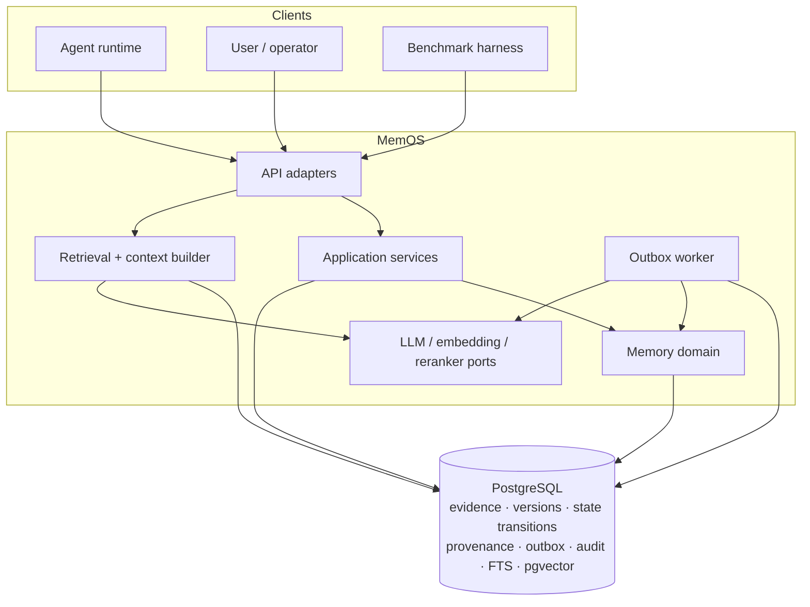
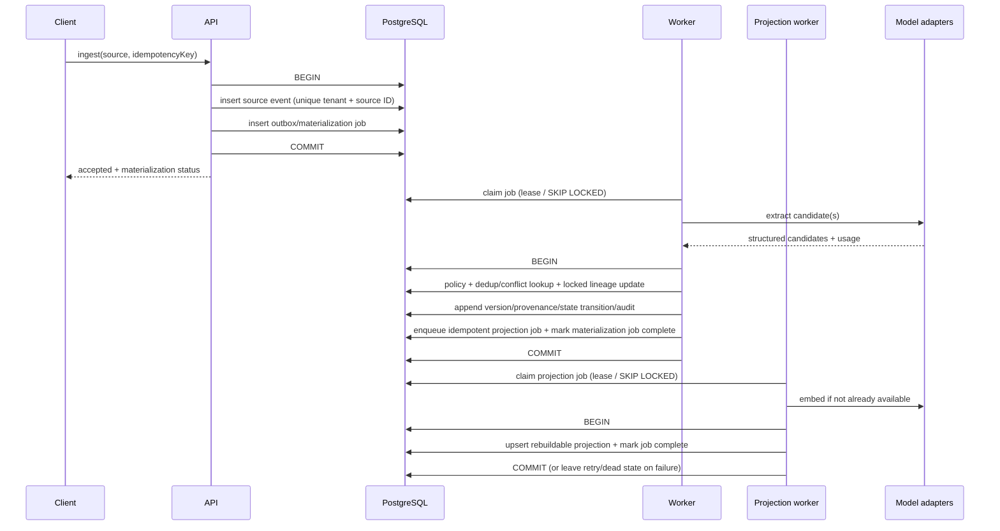
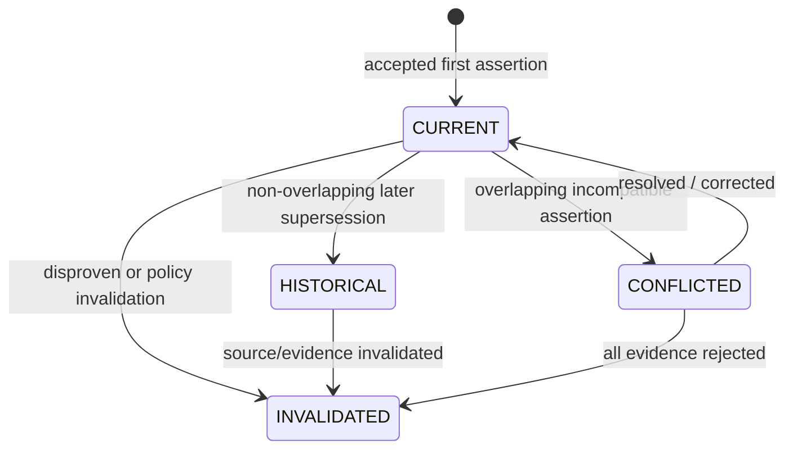

# Recommended first architecture

Status: `PROPOSED FOR MVP` — implementation and scale claims remain hypotheses until tested.

## Overview

Use a Java modular monolith with two runtime roles:

- **API role**: accepts source events and memory commands; serves retrieval and inspection.
- **Worker role**: materializes memories and derived indexes from a transactional outbox.

Both share domain/application modules and PostgreSQL. This preserves one consistency boundary while keeping expensive model calls off the request transaction.



## Module boundaries

| Module | Responsibility | Must not own |
|---|---|---|
| `ingestion` | source validation, idempotency, source/outbox transaction | LLM calls |
| `memory-domain` | lineages, versions, truth states, temporal invariants, policies | HTTP/provider details |
| `materialization` | jobs, extraction orchestration, retry, projection state | authorization policy decisions from model output |
| `retrieval` | query plan, candidates, fusion, reranking, selection | source-of-truth mutation |
| `context` | token budget, conflict/provenance rendering, prompt-data delimiters | ranking storage |
| `governance` | scope/ACL, sensitivity, correction, invalidation, delete workflow | semantic retrieval score |
| `audit-observability` | audit events, metrics, traces, replay/diff views | business truth decisions |
| `adapters` | PostgreSQL, model, embedding, reranker, clock/ID implementations | domain policy |

Package/module enforcement should prevent accidental coupling before services are split.

## Write flow and consistency boundary



The exact placement of embedding is an MVP spike decision. If the embedding provider is remote, holding a database transaction across the call is forbidden. Persist the authoritative version first, then materialize the vector under a separate idempotent projection job.

### Consistency contract

- Source acceptance: strong within PostgreSQL.
- Memory availability after ordinary conversation: eventual and observable.
- Explicit user-authored memory: may offer synchronous structured persistence without LLM extraction.
- Version transition: serializable per lineage via optimistic version or row/advisory lock; global serializability is unnecessary.
- Derived indexes: eventually consistent and rebuildable.
- Retrieval: returns a projection watermark/status so tests can wait for a defined state.

## Proposed logical data model

This is not a final SQL schema.

### `source_event`

`tenant_id`, `source_id`, `user_id`, `session_id`, `actor_type`, `source_type`, policy-controlled payload, `trust_level`, `occurred_at`, `received_at`, content fingerprint while retained, deletion state.

Source content is append-only while retained: corrections add evidence rather than overwrite it. A policy- or legally required erasure may purge the payload and derived content, leaving only a non-content tombstone/audit fact when the governing policy permits. A raw hash of low-entropy PII can be dictionary-guessed, so hard erase also removes content-derived fingerprints; it is not safe tombstone metadata by default.

Unique key: `(tenant_id, source_id)`.

### `memory_lineage`

Stable `memory_id`, tenant/user/agent scope, memory type, optional subject/entity and predicate, current state pointer/cache, lineage status, optimistic `lock_version`. The pointer/cache is transactional coordination state, not historical authority.

### `memory_version`

`version_id`, `memory_id`, monotonic `version`, content and normalized content, structured value, importance, confidence, proposed `event_time` and validity interval, creation transaction time, extractor/policy/model versions, content fingerprint. A version/assertion is immutable while retained; correction creates a new version, while required erasure may remove its content.

### `memory_state_transition`

Append-only transition ID, lineage and affected version IDs, resulting truth status, effective validity interval, reason/source, policy version, actor, and transaction timestamp. A transition can supersede an earlier state interpretation without rewriting the assertion. Current state and effective `valid_to` are reconstructed from this log or read from a transactionally maintained projection; while content is retained, history can be replayed as of any transaction time.

### `memory_source`

Many-to-many links from versions to source events with derivation role and evidence span. Multiple paraphrases can reinforce one version without losing provenance.

### `memory_projection`

Projection kind/model/version, vector or external key, lexical document/version, build state, last error, checksum, built timestamp. PostgreSQL implementation may physically split vector and FTS columns/tables.

### `memory_access_stats` (rebuildable, benchmark-gated)

Tenant/memory ID, `last_accessed_at`, authorized-selection count, optional time buckets/decayed access score, and stats version. This is an operational projection derived from retrieval/selection telemetry, not a mutable field on the immutable assertion. Recording it supports decay experiments; using access frequency, importance, or recency for ranking/retention remains disabled until a held-out ablation justifies the policy and tests feedback-loop bias.

### `outbox_job`

Job ID/type, aggregate/source/version ID, policy and projection/model version, state, attempt, next attempt, lease owner/expiry, payload reference, error class, timestamps. Both extraction/materialization and derived-projection work use durable jobs. Unique semantic job keys prevent duplicate side effects.

### `deletion_request` and tombstone

Feature 5 implements operation ID, scope/target, requester, policy basis, state per projection,
retry/lease metadata, and completion time. Request-time hiding removes projections before the
fenced worker purges authoritative content. `DEAD` remains isolated and can only return to
`PENDING` through tenant-bound privacy-admin requeue. Resurrection guards are append-only opaque
source/lineage IDs rather than raw content hashes. If a keyed HMAC is ever used, its key lifecycle
and erasure semantics remain part of the threat model, not assumed.

### `audit_event`

Actor, action, target, outcome, reason/policy version, request/trace ID, timestamp. Sensitive content is not copied into ordinary logs.

## Candidate extraction contract

The LLM returns a schema proposal rather than a write command:

```json
{
  "decision": "REMEMBER | IGNORE | REVIEW",
  "memoryType": "SEMANTIC | EPISODIC | PROCEDURAL | WORKING",
  "subject": "user",
  "predicate": "residence",
  "value": "Hangzhou",
  "normalizedContent": "The user currently lives in Hangzhou.",
  "eventTime": { "text": "in May 2026", "from": "2026-05-01", "to": "2026-06-01" },
  "importance": 0.0,
  "confidence": 0.0,
  "sensitivity": ["LOCATION"],
  "candidateRelations": ["SUPERSEDES residence"]
}
```

The application validates enums/ranges, trust/sensitive-data policy, temporal consistency, and candidate transitions. Model confidence is one feature, not calibrated truth.

## Version transition model

The arrows below are append-only transition events. They do not mutate a retained assertion row; the transactional current-state projection advances alongside the transition record.



Set-valued predicates (for example, favorite cuisines) must not be forced through single-valued supersession rules. Predicate policy defines cardinality and conflict behavior.

## Read pipeline

1. Parse query intent, referenced entities, requested time, and memory types.
2. Apply hard tenant/user/agent and sensitivity filters.
3. Retrieve independently:
   - dense semantic candidates via pgvector;
   - lexical candidates via PostgreSQL FTS;
   - structured entity/predicate/scope candidates;
   - temporal candidates for interval and change queries.
4. Fuse ranks with RRF initially; keep every component rank/score.
5. Apply current/historical/conflict policy according to query intent.
6. Optionally rerank behind a feature flag and strict deadline.
7. Select diverse evidence under item/token limits.
8. Render content as untrusted, provenance-bearing data.

The benchmark, not architecture prose, chooses weights, K, fusion constant, reranker, and thresholds.

## Failure recovery

| Stage | Transaction strategy | Retry / repair |
|---|---|---|
| Source + outbox | same DB transaction | client retry uses idempotency/source key |
| Job claim | short lease; recover expired claims | exponential backoff + bounded attempts + dead state |
| Extraction | no DB transaction held over remote call | retry transient errors; quarantine schema/policy failures |
| Version transition | short lineage-scoped transaction | optimistic retry; deterministic semantic job key |
| Embedding/FTS projection | separate idempotent job | rebuild from version; checksum/model-version reconciliation |
| Deletion | saga state per projection | retry until terminal; tombstone blocks resurrection |
| Reranking | request deadline | deterministic fusion fallback |

## Privacy and isolation

- Tenant ID is mandatory in repository method signatures and storage keys.
- Database row-level security is an optional defense-in-depth spike, not a replacement for application checks.
- Scope is explicit: user, session/task, agent-private, team/project-shared.
- Sensitive categories carry policy actions: reject, redact/tokenize, encrypt/restrict, or review.
- Content encryption and key management details require threat-model and deployment context; no unsupported “encrypted” claim will be made in MVP docs.
- Delete operations cover source-retention policy, retained memory payloads, projections, jobs, and cache (none initially); only policy-permitted non-content tombstones/audit facts remain.
- Feature 5 authenticates application scope from signed claims and implements this PostgreSQL-only
  deletion boundary. Production IdP/key lifecycle, RLS, backups/WAL, replicas, and future external
  projection/provider erasure remain deployment or later-architecture work.

## Observability

### Counters and histograms

- source events accepted/duplicated/rejected;
- candidates extracted/remembered/ignored/reviewed;
- extraction, embedding, write, and retrieval latency;
- token and model-call use per stage;
- dedup merge and conflict transition counts;
- job lag, retries, dead jobs, projection failures;
- query gate decisions, hit rate, Recall@K in evaluation;
- memories per tenant/user/type/status and storage growth;
- deletion propagation duration and failures.

### Diagnostic trace

`request → source → job → extraction output version → policy decision → lineage/version transition → projection versions → query plan → candidate component ranks → selected context → answer evaluation`

Content is redacted from default telemetry; authorized inspection uses auditable tools.

## Scale-out triggers

| Component | Stay with MVP while | Introduce specialized component when measured |
|---|---|---|
| Outbox polling | lag and DB load meet SLO | Kafka/CDC for multiple consumers, replay retention, or throughput isolation |
| PostgreSQL FTS | quality and p95 meet benchmark/load profile | OpenSearch for proven relevance, aggregation, or corpus-scale need |
| pgvector | filtered ANN/update SLO and index size are acceptable | dedicated vector store for measured scale/filter/availability need |
| No cache | DB p95 and cost are acceptable | Redis after a stable hot-key pattern and invalidation protocol exist |
| Relational entity projection | multi-hop metrics are acceptable | graph database after demonstrated gain covers complexity |
| Single region | recovery targets allow it | replicas/multi-region after explicit RPO/RTO and data-residency requirements |
