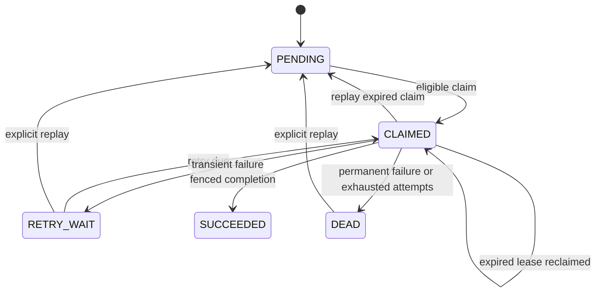

# Feature 1 — idempotent source ingestion and transactional outbox

Status: `DONE` and published on 2026-08-27. The verification matrix below records executed evidence rather than intended tests.

Feature 1 is the first business slice after the [engineering foundation](feature-0.md). It implements the source-acceptance and durable-work boundary described by the [problem definition](../architecture/01-problem-definition.md), [recommended architecture](../architecture/03-recommended-architecture.md), [MVP plan](../architecture/04-mvp-plan.md), and [ADR-0003](../adr/0003-transactional-outbox.md).

## Scope and contract

The API accepts a retained source event and creates one `MATERIALIZE_SOURCE` outbox job in the same PostgreSQL transaction. It returns before any model or other remote provider work. A separate worker claims durable jobs and invokes a deterministic fake handler outside the claim transaction.

The contract is **at-least-once delivery with an idempotent authoritative effect**, not provider-level exactly-once execution. A handler may be invoked more than once after a crash or expired lease. The same semantic job key must not produce more than one logical downstream effect.

### Authoritative records

`source_event` retains the accepted evidence and its trusted scope:

- tenant, user, agent, session, source, actor, and source-type identifiers;
- idempotency key and request/content fingerprint while content is retained;
- trust level, occurrence time, receipt time, policy-controlled payload, and deletion state;
- creation metadata required to trace acceptance without copying content into logs.

The retained fingerprint is content-derived data. It is not a safe non-content tombstone and must be removed by the governed hard-erasure work planned for Feature 5.

`outbox_job` is durable coordination state:

- job ID, tenant ID, `MATERIALIZE_SOURCE` type, source/aggregate reference, and semantic job key;
- `ingestion-v1` policy version and `deterministic-fake-v1` model/handler version;
- state, attempt count, maximum attempts, next-attempt time, and replay count;
- lease owner, expiry, and opaque `lease_token` fencing value;
- bounded error class and creation, update, and completion timestamps.

The outbox payload is a source reference, not a duplicate of the source body. PostgreSQL remains the authority; the job table is not evidence that a memory candidate or memory version exists.

### Uniqueness

- `(tenant_id, source_id)` identifies the logical source within a tenant.
- `(tenant_id, idempotency_key)` identifies a client request retry.
- `(tenant_id, semantic_job_key)` identifies one logical materialization intent.
- Foreign keys and repository methods carry tenant scope so an identifier from one tenant cannot address another tenant's record.

An exact retry returns the original source and job identifiers. Reusing an idempotency key or source ID with a different request fingerprint is a conflict, not a new source and not a silent duplicate.

## HTTP API shape

### Accept a source event

```http
POST /v1/source-events
Idempotency-Key: client-stable-key
Content-Type: application/json
```

At Feature 1 publication time, a trusted upstream supplied `X-Tenant-Id`, `X-User-Id`, and
`X-Agent-Id`; that historical boundary is `DEPRECATED`. Feature 5 removed the resolver. The
current runtime accepts scope only from verified bearer-token claims. The body still carries
`sessionId`, `sourceId`, `actorType`, `sourceType`, `trustLevel`, `occurredAt`, and the
policy-controlled payload, and it cannot override authenticated scope.

The first accepted request returns `202 Accepted`. Its receipt includes the stable source-event ID, source ID, materialization-job ID, acceptance time, duplicate indicator, and current materialization state. An exact idempotent replay returns `200 OK` with the same stable source/job identity. A key or source reuse with different immutable request data returns `409 Conflict` through the repository's RFC 9457 error convention.

### Inspect materialization

```http
GET /v1/materialization-jobs/{jobId}
```

The lookup is tenant-scoped even though the tenant is not encoded in the path. The response may expose state, attempt/max-attempt counts, next-attempt time, bounded error class, replay count, and timestamps. It must not expose source payload, request body, credentials, lease owner, or `lease_token`.

Feature 6 adds a source-level read model over the same authoritative jobs:

```http
GET /v1/source-events/{sourceEventId}/materialization
```

The response orders `MATERIALIZE_SOURCE`, `CANDIDATE_MATERIALIZATION`, and `PROJECTION_BUILD`
jobs and reports `PROCESSING`, `SUCCEEDED`, or `FAILED`. Any `DEAD` job makes the aggregate failed;
all observed jobs must be `SUCCEEDED` before it succeeds; every other valid chain is processing.
The aggregate includes creation/update/settlement timestamps and the same content-free per-job
diagnostics as the single-job endpoint. A missing source and a source in another authenticated
tenant/user/agent scope both return the same `404` contract.

Feature 6 extends this content-safe view with provider usage totals. `usage.complete` is true only
when every provider-bearing job succeeded on its first attempt without replay and every extraction
or projection usage record is present. Input/output/embedding tokens and call counts contain no
source content; a false completeness marker is a benchmark accounting failure, not an implicit
zero. Commit `db213df` and
[GitHub Actions run #35](https://github.com/Zhi-Xiang-Guo/memos/actions/runs/33281737584)
remotely verify the V008 projection-usage migration and PostgreSQL aggregation path.

This endpoint makes asynchronous completion observable. It does not provide synchronous
read-your-write behavior, promise an SLO, or establish a representative freshness distribution.

### Replay incomplete work

```http
POST /v1/materialization-jobs/{jobId}/replay
```

Replay is an operational command, scoped to the same tenant context as inspection. It may move `DEAD`, `RETRY_WAIT`, or an expired `CLAIMED` job back to `PENDING`; it reuses the original job and semantic key, resets `attempt` to zero, increments `replay_count`, clears lease/error fields, and sets `next_attempt_at` to the database current time. It never creates a second source event or a second logical intent. Replaying an ineligible job is a conflict.

Feature 1 itself did not provide a production authentication or operator-role system. Feature 5
now authenticates and scopes this API, while possession of a job ID remains insufficient for
authorization.

## Atomicity and idempotency

| Boundary or event | Required transaction/result | Idempotency rule |
|---|---|---|
| First valid ingestion | Insert `source_event` and `outbox_job`, then commit both | Unique source, idempotency, and semantic-job keys |
| Failure before commit | Roll back source and job | Retry can create the pair once |
| Commit succeeds; response is lost | Source and job remain durable | Exact retry returns their existing identity |
| Same idempotency key, same immutable request | No second insert | Return duplicate receipt |
| Same source ID, same immutable request | No second source or job | Return the existing receipt |
| Same key or source ID, different immutable request | No mutation | Return `409 Conflict` |
| Worker unavailable after acceptance | Job remains `PENDING` | Later worker can claim it |
| Claim | Short transaction selects eligible work with `FOR UPDATE SKIP LOCKED`, writes a fresh lease token, and commits | Attempt increments only on successful claim/reclaim |
| Handler execution | Runs after the claim transaction commits | No database transaction is held across handler/provider work |
| Lease renewal | PostgreSQL-time compare-and-set over job ID, `CLAIMED`, owner, token, and unexpired lease | Slow or batch-queued work retains the same completion right; a stale owner updates zero rows |
| Completion | Compare-and-set using job ID, `CLAIMED`, owner, unexpired lease, and `lease_token` | A stale worker updates zero rows |
| Completion response/process loss | Committed `SUCCEEDED` job is not claimable | A restart observes terminal state |
| Replay | Reuse job and semantic key | Downstream handler must remain logically idempotent |

The production deterministic fake performs no remote call and runs outside the claim transaction. Completion atomically changes the fenced job to `SUCCEEDED` and inserts a payload-free `materialization_result` row keyed by `(tenant_id, semantic_job_key)`. This ledger proves one visible logical Feature 1 effect even if the handler is invoked again after a crash; it does not contain source or candidate content and does not claim provider-level exactly-once execution.

## Job state, leases, and fencing



Claims are ordered, bounded batches. `FOR UPDATE SKIP LOCKED` allows multiple workers to claim different rows without serializing on one eligible job. Every successful claim or expired-lease reclaim:

1. changes the job to `CLAIMED`;
2. increments `attempt` from its initial value of zero;
3. records the process's worker ID;
4. writes a new opaque `lease_token`;
5. sets `lease_expires_at` from PostgreSQL time.

Database time is authoritative for eligibility and expiry. Application wall-clock skew must not decide whether a lease is valid.

An expired `CLAIMED` job with remaining attempts may be reclaimed directly with a new token and
incremented attempt. An expired claim whose `attempt` has reached `max_attempts` is atomically
moved to `DEAD` before it can be claimed again. Completion, failure, and lease renewal use
compare-and-set conditions including the current token; an old worker cannot complete or fail
work after another worker has reclaimed it.

Feature 6 hardening starts one process-local heartbeat for every row in a claimed batch before
serial handler execution begins. Each heartbeat attempts renewal every one third of the configured
lease duration. The PostgreSQL adapter extends from `clock_timestamp()`, and only while job ID,
state, owner, token, and unexpired lease still match. Stopping a heartbeat waits for an in-flight
renewal before the worker writes a non-atomic handler's success/retry/dead state. Handlers that
commit atomically retain their own database fence as the final authority. A renewal cannot provide
provider-level exactly-once execution and cannot rescue a lease after expiry; it reduces avoidable
duplicate slow calls while all existing idempotency and completion fences remain mandatory.

## Retry, dead state, and replay

Transient failures move a currently leased job to `RETRY_WAIT`, clear the lease, and set `next_attempt_at` using bounded exponential backoff:

```text
delay = min(backoff-cap, backoff-base * 2^(attempt - 1))
```

The backoff calculation is deterministic under the injected clock/configuration. A permanent/poison failure moves directly to `DEAD`. A transient failure on the last allowed attempt also becomes `DEAD`. Stored and logged failure data use stable bounded classes; raw exception messages and source content are excluded.

The worker configuration uses the `memos.worker` prefix:

- `worker-id`;
- `poll-delay`;
- `batch-size`;
- `lease-duration`;
- `max-attempts`;
- `backoff-base`;
- `backoff-cap`.

Environment variables such as `MEMOS_WORKER_ID` may override deployment values. The default local path continues to use deterministic fakes and requires no paid API.

### Failure outcomes

| Fault point | Observable result | Recovery |
|---|---|---|
| Before source/outbox commit | Neither row exists | Safe client retry |
| After commit, before response | Both rows exist | Exact client retry returns existing receipt |
| Worker stopped after commit | Job remains ready | Start/restart worker |
| Crash after claim | Job remains `CLAIMED` until expiry | New token reclaims it or marks it `DEAD` at the attempt limit |
| Handler or batch wait exceeds the original lease | Heartbeat extends the same fenced claim | Another worker cannot reclaim while renewals continue successfully |
| Lease expires while old worker runs | Old token is fenced out | Current claimant owns the only valid completion right |
| Transient handler failure | `RETRY_WAIT` with future attempt time | Automatic bounded retry |
| Poison/permanent handler failure | `DEAD` with bounded error class | Inspect, fix cause, explicit replay if safe |
| Handler succeeds, process dies before completion | Handler may run again | Semantic idempotency prevents a duplicate logical effect |
| Completion commits, process dies before acknowledgement | Job remains `SUCCEEDED` | No replay or reclaim is needed |

## Observability and privacy

Operational telemetry must make incomplete work visible without copying source content.

Low-cardinality counters and timers cover accepted, duplicate, rejected, claimed, succeeded,
retried, lease-reclaimed, lease-renewed/renewal-lost/renewal-failed, dead, and replayed jobs;
handler duration; queue-ready age; and materialization freshness. Tenant, source, job, worker, and
idempotency identifiers are correlation fields, not metric labels.

Structured logs and traces may carry `traceId`, job ID, source-event ID, job type, attempt, state transition, policy/model version, and bounded error class. They must not contain:

- source payload or request body;
- content or request fingerprints;
- idempotency keys;
- database/provider credentials;
- exception text that may echo payload;
- lease tokens.

The API and worker inherit the Feature 0 liveness/readiness contract. A live worker may be temporarily unable to process jobs; database readiness and job-state metrics distinguish that condition from process death.

## Explicit non-goals

Feature 1 does not implement or claim:

- real LLM calls, candidate extraction, `shouldRemember`, sensitive-data classification, or review/quarantine policy (Feature 2);
- memory lineages, immutable assertion versions, temporal transitions, deduplication, conflicts, correction, or invalidation (Feature 3);
- pgvector/FTS projections, hybrid retrieval, reranking, context construction, or retrieval quality (Feature 4);
- complete authentication/ACL policy, governed hard deletion, resurrection guards, poisoning defenses, or content-safe administrative audit (Feature 5);
- benchmark quality, latency, throughput, scale, token, or cost results (Feature 6);
- Kafka, Redis, OpenSearch, a graph database, a dedicated vector database, cross-region delivery, or end-to-end exactly-once guarantees.

`SUCCEEDED` in Feature 1 proves only that the deterministic Feature 1 handler completed under the job contract. It does not mean that a memory candidate, authoritative memory version, vector, or lexical projection is queryable.

## Verification matrix

| Gate | Target evidence | State |
|---|---|---|
| Migration from empty PostgreSQL/pgvector database | `source_event`/`outbox_job` constraints, indexes, and Flyway validation | `PASS` — PostgreSQL 18.6 + pgvector 0.8.6 |
| First ingestion | One source and one `MATERIALIZE_SOURCE` job committed | `PASS` — adapter integration + runtime smoke |
| Exact idempotency-key retry | Stable source/job identity; no duplicate rows | `PASS` |
| Same source-ID retry | Stable source/job identity; no duplicate rows | `PASS` |
| Conflicting retry | `409`; existing source/job unchanged | `PASS` — store classification and API mapping |
| Concurrent duplicate ingestion | One committed logical source/job under contention | `PASS` — 24 concurrent calls |
| Failure before commit | Neither source nor job persists | `PASS` — injected outbox trigger failure |
| Commit followed by unavailable worker | Durable visible `PENDING` job | `PASS` — runtime smoke starts worker after receipt |
| Multiple workers | `SKIP LOCKED` claims distinct eligible jobs | `PASS` — 20 jobs, two concurrent claimers |
| Crash after claim / worker restart | Expired lease is reclaimed with a new token | `PASS` |
| Stale-worker fencing | Old-token complete/retry operations affect zero rows | `PASS` |
| Slow handler lease safety | Monitor the full claimed batch; stop before terminal update; stale token cannot renew; handler beyond original lease is not reclaimed | `PASS` — unit and PostgreSQL timing/fencing tests; remote run `#32` |
| Transient failure | Deterministic exponential backoff and eventual success/dead outcome | `PASS` — unit + PostgreSQL integration |
| Poison job | Direct bounded-error `DEAD` result | `PASS` |
| Handler success before completion crash | Reclaim path creates one payload-free logical effect | `PASS` |
| Completion commit before process crash | Terminal job is not reclaimed | `PASS` |
| Explicit replay | Same job/semantic key, reset attempt, incremented replay count | `PASS` |
| Tenant/user/agent isolation | Cross-scope inspect/replay is indistinguishable from not found | `PASS` |
| Source-chain observation | Scope-safe ordered aggregate with explicit processing/success/failure settlement | `PASS` - Feature 6 unit/API/client and PostgreSQL checks in CI run `#30` |
| Handler transaction boundary | Handler observes no active Spring transaction | `PASS` |
| Observability redaction | Runtime log/status marker scan; no content or lease fields | `PASS` |
| Java verification | `./mvnw -B -ntp clean verify` | `PASS` — 37 tests, zero failures/errors |
| Python workspace | locked sync, format, lint, and tests | `PASS` |
| Runtime smoke | ingest while worker stopped, recover, succeed, and inspect status | `PASS` — `scripts/smoke-feature1.sh` |
| Markdown links | `python3 scripts/check_markdown_links.py` | `PASS` |
| Git publication | coherent Feature 1 commit pushed; local `HEAD` equals `origin/main` | `PASS` — implementation commit `01f017d9058db911277dd7c055ebd02e3d36826c` was pushed and verified against `origin/main` |

Feature 1 may be marked `DONE` only after the fault suite demonstrates no lost committed source and no duplicate logical effect, every applicable gate above is updated with actual evidence, the coherent commit is pushed, and local `HEAD` matches `origin/main`.
