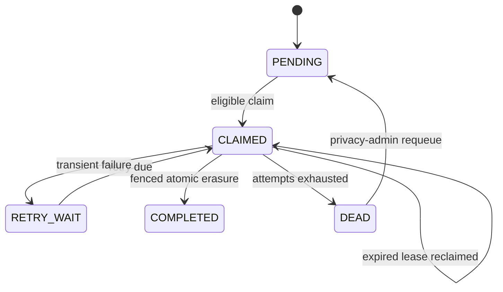

# Feature 5 — authentication, governed erasure, audit, and poisoning boundary

Status: `DONE / PUBLISHED`. Commit `ae377143929cf2a7fcfbfccae21d8792b7275d7e` is published, and
[GitHub Actions run #22](https://github.com/Zhi-Xiang-Guo/memos/actions/runs/33272314267) passed the
Java/PostgreSQL, Python, docs, and complete Feature 0–5 compose gates.

Feature 5 replaces the temporary trust boundaries from Features 1–4 and implements the privacy
workflow described by the [recommended architecture](../architecture/03-recommended-architecture.md),
[MVP plan](../architecture/04-mvp-plan.md), and
[ADR-0005](../adr/0005-authentication-governed-erasure.md). PostgreSQL remains authoritative;
vector/FTS/checkpoint rows are rebuildable projections.

## Feature boundary

Feature 5 owns:

- verified bearer-token scope and `USER`, `OPERATOR`, and `PRIVACY_ADMIN` authorization;
- content-safe `401`, `403`, and scoped `404` responses carrying a trace ID;
- memory- and user-level governed-erasure requests with operation status;
- immediate read/projection hiding before asynchronous physical erasure;
- lease-fenced retry, dead-letter isolation, and privacy-admin requeue;
- source, authority, projection, job, replay, and resurrection defenses;
- append-only content-safe audit facts and opaque erasure tombstones;
- deterministic hostile-memory escaping/rendering conformance.

It does not claim a production identity provider, asymmetric/JWKS key rotation, token revocation,
database row-level security, backup/WAL erasure, external-provider deletion, legal-policy
sufficiency, anonymization of governance/scope identifiers, or general prompt-injection
resistance. Tenant/user/agent/source/session/idempotency identifiers are assumed to be opaque and
must not carry user content or direct PII; a deployment that violates that contract needs an
additional identifier-erasure design. These boundaries require deployment policy or Feature 6
evaluation evidence.

## Authentication and authorization

The API is a stateless Spring Security resource server. It accepts HS256 JWTs only when signature,
issuer, audience, expiry, subject, tenant/user/agent identifiers, and the complete role list are
valid. Scope comes only from verified `tenant_id`, `user_id`, and `agent_id` claims; legacy scope
headers are ignored. Unknown roles invalidate the token rather than being silently discarded.

| Role | Allowed Feature 5 capability |
|---|---|
| `USER` | Ordinary scoped business APIs and self-service deletion of a memory in the same tenant/user/agent scope |
| `OPERATOR` | Retrieval diagnostics and operational actuator endpoints; successful trace access is audited |
| `PRIVACY_ADMIN` | Tenant-bound user erasure, admin deletion status, and dead-operation requeue |

Health probes remain unauthenticated. Every other `/v1/**` route requires an allowlisted role.
Cross-scope memory lookup and deletion return the same content-safe `404` as an absent record.

The checked-in HS256 generator and default secret exist for credential-free local smoke only. A
real deployment must replace this mode with an issuer/key lifecycle appropriate to its threat
model; no production identity-provider claim is made.

## Deletion HTTP contract

| Method and path | Authority and behavior |
|---|---|
| `POST /v1/deletions/memories/{memoryId}` | `USER`; requires `Idempotency-Key` and a policy basis; target must be active in exact authenticated scope |
| `POST /v1/admin/deletions/users/{userId}` | `PRIVACY_ADMIN`; requests tenant-bound erasure without disclosing whether historical user content exists |
| `GET /v1/deletions/{operationId}` | Original authenticated requester only |
| `GET /v1/admin/deletions/{operationId}` | `PRIVACY_ADMIN`; tenant-bound operational status |
| `POST /v1/admin/deletions/{operationId}/requeue` | `PRIVACY_ADMIN`; moves the same dead operation back to `PENDING` and records an audit fact |

An exact request replay returns the original operation. Reusing an idempotency key with different
immutable input returns `409`. A new key for an already requested target returns the same existing
operation, including when it is `DEAD`; recovery never creates a second authoritative deletion
identity.

## Erasure workflow and invariants

The request transaction first obtains a target advisory lock. User deletion shares a
tenant/user-scope advisory lock with ingestion, so either ingestion commits before the request and
is included in erasure, or the deletion request commits first and the write is rejected.

The request transaction then:

1. appends the content-safe request audit fact;
2. changes affected source/lineage lifecycle to `DELETE_REQUESTED`;
3. removes search projections and checkpoints immediately;
4. makes relevant incomplete jobs terminal with `GOVERNED_ERASURE`.

All reads, retrieval candidates, materialization, projection commits, and explicit job replay
require active source/lineage state. A deletion therefore becomes invisible before the worker
finishes physical erasure.

The worker claims operations with `FOR UPDATE SKIP LOCKED`, a database-time lease, and a fresh
opaque lease token. One fenced PostgreSQL transaction then:

- inserts opaque source/lineage tombstones;
- purges source payload and content-derived fingerprints for user erasure;
- purges candidate/version values, normalized content, metadata proposals, and fingerprints;
- redacts retained transition reason/actor content to fixed `ERASED` values;
- removes current-state, mutation, vector/FTS, and checkpoint projections;
- cancels remaining relevant jobs;
- advances source/lineage lifecycle to `ERASED`;
- appends the completion audit fact and marks the operation `COMPLETED`.

Database triggers permit retained-content mutation only while the transaction-local erasure
operation is currently claimed and its lease is unexpired. The final operation update repeats the
lease fence. If the lease expires after partial statements, an internal exception rolls back the
entire transaction; the stale worker reports lease loss and a new claimant retries from the
unchanged `DELETE_REQUESTED` state.

`DEAD` means isolated and incomplete, not canceled. Data stays hidden, user-scope ingestion stays
blocked, and the original operation is the only recovery target. Privacy-admin requeue resets its
attempt budget and trace context without restoring any content or projection.

## Audit and poisoning boundary

`audit_event` is append-only and contains actor/scope identifiers, action, opaque target,
outcome/reason, policy version, trace ID, and timestamp. It has no payload/query/memory/provider
field. Deletion request/completion/requeue and successful retrieval-trace access use typed audit
events. Trace access fails closed if its audit insert fails.

The poisoning fixture contains closing-tag, role-like, and tool-like hostile strings. The context
assembler XML-escapes each string and places it as text beneath exactly one
`<memory-evidence trust="untrusted-data">` root. The test reparses the rendered XML and verifies
that no hostile `system` or `tool` element became structure and that text round-trips exactly.

This proves one deterministic instruction/data boundary only. It is not evidence that a real LLM
will ignore all injected memory or that the write policy detects every poisoned source. Feature 6
must run write-to-retrieve-to-use attacks against fixed model snapshots.

## Verification matrix

| Gate | Target evidence | Current state |
|---|---|---|
| JWT/RBAC | Forged headers, signature/audience/claim checks, scope derivation, role routes | `PASS` locally — 4 focused MVC/security cases |
| Worker state machine | Success, retry/backoff, dead, lease loss, expired exhausted claim | `PASS` locally — 5 unit cases |
| Poisoning boundary | Four hostile strings remain text under one untrusted root; manifest SHA is fixed | `PASS` locally — SHA `b915bba484f09c53d7d979d8bb8e17f2cfc80ded2244914d101ce06bacde7d42` |
| Production/test compilation | API, worker, adapters, governance, and integration sources | `PASS` locally with Java 25/Maven Wrapper |
| PostgreSQL migration and erasure | V006, tenant isolation, immediate hiding, purge, tombstone immutability, retry/requeue | `PASS` — remote PostgreSQL integration in run #22 |
| Concurrency and replay | User deletion versus ingestion, lease-expiry rollback, old-job replay, restart | `PASS` — Testcontainers and compose in run #22 |
| Audit persistence | Content-safe trace/deletion facts and fail-closed trace access | `PASS` — PostgreSQL integration/runtime in run #22 |
| Runtime smoke | JWT/RBAC, audit, memory/user deletion, replay and resurrection defenses | `PASS` — `scripts/smoke-feature5.sh` in run #22 |
| Full Java/Python/docs verification | Repository-wide required commands | `PASS` — run #22 |
| Git publication | Coherent commit pushed and remote CI green | `DONE` — `ae37714`, run #22 |

No formal quality, latency, scale, cost, legal-compliance, or security-effectiveness result is
created by these gates. Deterministic fixtures and runtime smoke are implementation evidence only.
