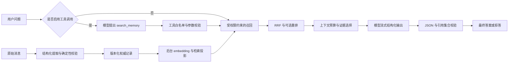

# RAG 实战：从记忆写入到流式回答

Status: `IMPLEMENTED / LOCALLY VERIFIED` — 2026-09-29。

本次用户请求授权补齐 AI 应用实战能力并重构包边界。这是已有检索能力之上的应用扩展，
不进入 Advanced Memory 阶段，不改变 Feature 6 已冻结的正式评测协议。

## 1. 先运行，再按能力拆解

默认 fake 模式不需要付费凭证。它能验证整条链路，但回答模型固定拒答，不能用来展示
真实回答质量。真实模型接入方式在第 5 节。

在仓库根目录，准备项目支持的 JDK（生产编译目标 Java 25）和 Docker，然后：

```bash
./mvnw -B -ntp clean verify
docker compose up -d --wait postgres
```

分别在两个终端启动 API 和 worker；以下端口避开常用的 8080/8081：

```bash
MEMOS_API_PORT=18080 java -jar applications/memos-api/target/memos-api-0.1.0-SNAPSHOT-exec.jar
```

```bash
MEMOS_WORKER_PORT=18081 java -jar applications/memos-worker/target/memos-worker-0.1.0-SNAPSHOT-exec.jar
```

已启动服务时，在另一个终端运行：

```bash
python3 scripts/smoke-rag-practice.py --base-url http://localhost:18080
```

也可以在只有数据库运行时执行 `MEMOS_API_PORT=18080 MEMOS_WORKER_PORT=18081 ./scripts/smoke-rag-practice.sh`，
由包装脚本编译、启动、测试并关闭本次 API/worker；CI 使用这条命令。

脚本使用独立随机 tenant，写入 synthetic 主题偏好，等待 source-level materialization
完成，验证 JSON 回答、只读工具、SSE 顺序、空租户隔离和无效 token 拒绝。
它要求默认 fake extraction、embedding、answer provider。自定义数据库和 JWT secret 时，
三个终端应使用一致配置；脚本只调用本地开发 JWT 生成器，不是生产登录工具。

## 2. 一条完整链路



**文档 RAG** 的入库是解析 → 清洗 → 按段落/token 切块 → chunk metadata → embedding → 索引。
**本次实现的 memory RAG** 使用已有的候选事实提取和版本治理代替文档切块。
两者共享召回、重排、上下文和回答阶段；本次没有实现 PDF 解析、文档上传或通用切块服务。
不要为了练习把文档 chunk 当成可信用户事实，直接绕过 MemOS 的写入策略。

## 3. 能力与代码对照

| 能力 | 运行时位置 | 自己动手的验收题 |
|---|---|---|
| RAG 全链路 | [共享检索服务](../../modules/context/src/main/java/dev/memos/context/MemoryEvidenceService.java)、[回答编排](../../modules/answering/src/main/java/dev/memos/answering/service/RagAnswerService.java) | 写入主题偏好，等待投影完成，画出问题到最终引用的路径 |
| embedding | [现有 Ollama embedding](../../modules/adapters/src/main/java/dev/memos/adapters/embedding/OllamaEmbeddingAdapter.java) | 解释离线文档/事实向量与在线 query 向量为何必须使用兼容模型 |
| reranker | [Ollama 重排](../../modules/adapters/src/main/java/dev/memos/adapters/answering/OllamaRerankerAdapter.java)、[混合检索](../../modules/retrieval/src/main/java/dev/memos/retrieval/HybridRetrievalService.java) | 在同一候选集合上开关重排，比较次序、效果与耗时；重排不能补回召回时漏掉的证据 |
| 结构化输出 | [回答模型适配](../../modules/adapters/src/main/java/dev/memos/adapters/answering/OllamaAnswerModelAdapter.java)、[Answer 契约](../../modules/answering/src/main/java/dev/memos/answering/model/Answer.java) | 给出格式正确却引用未知 ID 的 JSON，观察最终答案被拒绝 |
| 工具调用 | [模型端口](../../modules/answering/src/main/java/dev/memos/answering/port/AnswerModelPort.java)、[工具契约](../../modules/answering/src/main/java/dev/memos/answering/model/ToolCall.java) | 尝试 delete_memory、两个工具调用、query 外的 tenantId 参数，验证不能执行 |
| 流式响应 | [HTTP 接口](../../applications/memos-api/src/main/java/dev/memos/api/answering/AnswerController.java)、[传输层](../../modules/adapters/src/main/java/dev/memos/adapters/answering/OllamaChatTransport.java) | 区分 delta、answer、done；断流时不能把片段保存为成功答案 |
| 超时重试 | [传输层测试](../../modules/adapters/src/test/java/dev/memos/adapters/answering/OllamaAnswerModelAdapterTest.java)、[并发准入](../../applications/memos-api/src/main/java/dev/memos/api/answering/AnswerExecution.java) | 复现 503、响应体挂起、输出后断流，解释哪些重试、哪些终止 |
| 分层评估 | [练习评测](../../benchmark/src/memos_benchmark/rag_practice.py)、[正式指标](../../benchmark/src/memos_benchmark/metrics.py) | 构造召回缺失、预算截断、生成错误三种情况，分别定位 |

建议顺序：先跑 fake smoke，再读共享检索和回答编排；随后逐个运行故障测试，最后接真实模型。
不要在不了解基础链路时同时开启工具改写和重排，否则很难定位效果变化来自哪里。

## 4. 接口与契约

使用已有认证机制生成本地 token：

```bash
token=$(python3 scripts/generate-dev-jwt.py --tenant practice --user user-a --agent agent-a --subject learner --role USER)
```

普通 JSON：

```bash
curl --fail-with-body http://localhost:18080/v1/answers \
  -H "Authorization: Bearer $token" -H 'Content-Type: application/json' \
  -d '{"question":"我喜欢什么编辑器主题？","toolCalling":false,"rerank":false,"limit":8,"maxTokens":1200}'
```

流式回答（POST SSE，浏览器可用 fetch 读取，原生 EventSource 不能发送此 POST body）：

```bash
curl -N --fail-with-body http://localhost:18080/v1/answers/stream \
  -H "Authorization: Bearer $token" -H 'Content-Type: application/json' \
  -d '{"question":"我喜欢什么编辑器主题？","toolCalling":true,"rerank":false}'
```

新 token 对应的 scope 没有数据时会拒答。先用相同 token 写入 source event；smoke 脚本自己的
随机 scope 与这里不同，不能跨租户读取脚本写入的记录。

请求字段：`question` 必填，最长 4096；`toolCalling`、`rerank`、`vectorOnly` 默认 false；
`limit` 默认 8、范围 1–20；`maxTokens` 默认 1200、范围 64–8192。
`maxTokens` 是现有 embedding tokenizer 测得的 evidence 预算，不是回答模型完整输入窗口。
应用端不接收 tenant/user/agent 参数；scope 只来自验证后的 JWT。

最终 JSON 固定为：

```json
{"answer":"现有证据不足，无法回答。","abstain":true,"citations":[]}
```

非拒答必须包含至少一个引用；拒答不能包含引用；引用不重复，且必须是实际进入上下文的
version ID。这个校验能保证引用身份有效，不能证明答案语义确实由证据支持。

SSE 顺序如下；没有工具调用时无 tool，没有证据时无 delta：

| 事件 | 含义 |
|---|---|
| `tool` | JSON 对象中的 name 是已校验的只读工具名，不暴露模型参数或推理 |
| `evidence` | 本次 rankedIds、selectedIds 和 rerankOutcome，可记录为评测观察 |
| `delta` | JSON 对象中的 text 是结构化 JSON 的增量字符串，未通过最终校验，只能作为临时显示 |
| `answer` | JSON schema、拒答规则与引用集合均已通过的答案 |
| `done` | 成功完成；客户端应同时要求 answer 与 done |
| `error` | 内容安全错误码；不能把已收到的 delta 当最终答案，没有 done |

模型实际按 NDJSON 增量返回，服务转换为 SSE，不是先等待完整回答再人为切片。
断线无法保证客户端收到 error。没有 done 的连接结束始终按不完整处理。

## 5. 真实模型接入与重排

确认本机已有支持 tool calling 和 structured outputs 的 Ollama 模型后，重启 API：

```bash
export MEMOS_API_PORT=18080
export MEMOS_ANSWER_PROVIDER=ollama
export MEMOS_ANSWER_BASE_URL=http://localhost:11434
export MEMOS_ANSWER_MODEL=qwen3:4b
export MEMOS_ANSWER_TIMEOUT=60s
export MEMOS_ANSWER_REQUEST_TIMEOUT=20s
export MEMOS_ANSWER_MAX_ATTEMPTS=2
export MEMOS_RERANKING_ENABLED=true
export MEMOS_RERANKER_MODEL_VERSION="$MEMOS_ANSWER_MODEL"
export MEMOS_RERANKER_TIMEOUT=5s
java -jar applications/memos-api/target/memos-api-0.1.0-SNAPSHOT-exec.jar
```

模型 tag 必须在你的 Ollama 中实际存在，并具有所需能力；以上配置不会下载模型。
当前实战采用同一个配置模型做回答和可选 listwise 重排，便于最小复现。重排通过独立端口
接入，未来可以替换为 cross-encoder。embedding 是另外的角色，继续由已有
`MEMOS_EMBEDDING_*` 配置控制，不要用生成模型 tag 代替 embedding 配置。

只开启回答模型、保留 fake embedding，可以验证调用协议，仍不能评估真实召回质量。
要比较质量，必须使用真实提取与 embedding，遵守现有模型维度、版本与投影重建约束。
新回答适配校验返回 model tag，不提供不可变 digest attestation；正式实验仍使用
Feature 6 的版本固定、manifest 与 verifier，不可把这个练习接口的结果混入正式表。

embedding 把 query/事实映射到向量用于大范围候选搜索；reranker 对已召回的少量
query–candidate 组合重新排序。后者额外增加模型调用与延迟；它不是向量库，也不负责授权。
重排输出漏 ID、重复 ID、增加 ID、模型身份不符、超时或调用失败时，已有检索服务回退到 RRF。

## 6. 超时、重试与并发边界

- 默认总回答预算 60 秒，单模型请求 20 秒，最多 2 次尝试，允许配置到 1–3 次。
- 单次模型预算覆盖连接、响应头和整个响应体；测试覆盖收到响应头后挂起的服务。
- 429、5xx、传输失败、超时仅在尚未发出任何模型内容时有限重试；短退避带随机抖动。
- 4xx（429 除外）、结构错误、非法工具参数不重试。首次内容发出后失败不重试。
- 本次工具只有一次只读 search_memory，模型不拥有写入、删除和授权能力。这里没有无限 Agent 循环。
- API 默认同时处理最多 8 个回答；饱和返回 429。取消早于任务启动也会释放准入名额。
- 断线/超时取消任务并关闭活动模型响应流。已有 JDBC/embedding 操作的底层取消效果仍依赖驱动；
  HTTP 预算终止不等于保证供应商立即停止计算，因此不作成本 exactly-once 保证。
- 模型输出限制 2048 tokens、响应体 1 MiB、单 NDJSON 行 64 KiB；这些是保护性限制，不是实测最佳值。
- 超时前尚未提交响应的 JSON 接口返回 504；流式接口已经建立后用 error/缺失 done 表示失败。

## 7. 检索和回答分别评估

先跑一个无需模型的**人工构造指标练习**：

```bash
cd benchmark
uv sync --locked --python 3.14.7
uv run python -m memos_benchmark.rag_practice \
  --input fixtures/rag-practice/labeled-examples.jsonl \
  --output ../benchmark-artifacts/rag-practice/report.json
```

四个样例分别代表正确、召回漏证据、上下文丢证据、生成出错。
这个输出带 `PRACTICE_ONLY`，不是模型运行结果，也不是正式 benchmark。

实际评估时，每个 case 预先标注 `gold_ids`（权威版本 ID）、`accepted_answers`、
`must_abstain`；使用同一次 SSE 的 evidence 事件填 ranked/selected ID，最终 answer 事件填 output。
必须保留失败 case：`status=FAILED`、`output=null`，如果检索也失败则
`retrieval_status=FAILED`、ranked/selected 均为空。不要用检索返回值反过来定义 gold。

| 层 | 指标 | 说明 |
|---|---|---|
| 检索 | Recall@K | 每题找回 gold 证据数 / gold 总数，再对有 gold 的题平均 |
| 检索 | Hit@K | 至少命中一个 gold 的题目比例；多跳问题不能用它代替 Recall |
| 检索 | Precision@K、MRR | 返回证据的相关占比、首个正确证据的倒数排名 |
| 上下文 | context_complete_rate | 经过预算选择后，是否保留回答所需的全部证据 |
| 回答 | accuracy | 规范化精确答案匹配或正确拒答，同时引用格式/范围有效；适合短事实题 |
| 回答 | citation_valid_rate | 引用属于实际上下文；不是语义支持率 |
| 回答 | abstention_f1 | 该拒答时是否拒答、不该拒答时是否误拒答 |
| 回答 | human_supported_rate | 只统计人工审核过的支持性标签；未评审时返回 null，不自动猜测 |

自由文本答案不能只靠 exact match。建议人工盲评“是否正确、是否由证据支持、是否完整、
是否混入无依据内容”，或者设计经过人工校准的评审模型。这个练习工具没有声称完成语义裁判。

正式对比继续使用 [Feature 6](feature-6.md)：同数据、同预算、固定模型、保留原始输出和失败。
当前正式结果仍为 [NOT RUN](../benchmark/results.md)。

## 8. 重构与包治理

- 新增独立 `answering` 模块，`model` 放契约，`port` 定义被调用能力，`service` 负责编排。
- 供应商协议、JSON 编解码、HTTP 重试留在 `adapters.answering`。
- Spring 组装留在 `adapters.spring`，HTTP/SSE 与并发准入留在 `api.answering`。
- 原 `MemoryRetrievalController` 改为调用 `MemoryEvidenceService`，原检索与回答复用同一条
  检索→上下文路径，已有接口响应契约不变。
- [架构测试](../../architecture-tests/src/test/java/dev/memos/architecture/ModuleBoundaryTest.java)
  检查模块无环、领域纯净、业务模块不得依赖适配器，并新增回答模块的五条包边界约束。

完整依赖约束与后续迁移原则见 [包治理说明](../architecture/05-package-governance.md)。

## 9. 验证与限制

2026-09-29 本地验证通过：

- Maven Wrapper `clean verify`：全部模块、数据库集成/故障测试、HTTP/SSE 测试和 9 条架构规则通过。
  本机使用 JDK 26，生产代码按仓库要求以 `--release 25` 编译；不是 Java 25 运行时验证记录。
- Python 3.14.7 locked workspace：Ruff format/check 与 70 个测试通过。
- Markdown 本地链接检查通过。
- 独立 PostgreSQL 18 + API + worker：`smoke-rag-practice.py` 验证写入、处理完成、检索、工具、
  增量 SSE、最终结果、跨租户隔离和无效 token 拒绝。
- 手工构造四案例的练习报告可再生；仅用于验证指标定义。
- 运行 smoke 修复了 String SSE payload 被原样输出的问题，新增断言确保每个 data 都是 JSON 对象。
没有真实 Ollama 模型运行记录；网络适配测试使用本地 HTTP stub。
没有新增正式质量、延迟、成本或安全有效性声明。

官方协议核对：
[Ollama streaming](https://docs.ollama.com/capabilities/streaming)、
[tool calling](https://docs.ollama.com/capabilities/tool-calling)、
[structured outputs](https://docs.ollama.com/capabilities/structured-outputs)。
