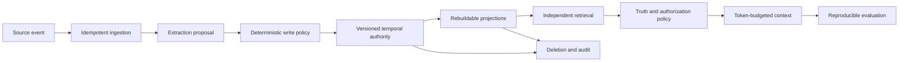

# MemOS 半年学习、项目深化与面试路线

这份路线面向一个具体目标：用六个月把 MemOS 从“会调用向量检索的 AI 项目”做成一个能经受后端、AI Infra、金融科技和 Agent 平台面试追问的长期记忆系统，并且能够说明每个设计为什么存在、证据是什么、边界在哪里。

它不是课程清单。每一阶段都必须形成仓库内可复核的代码、测试、实验或文档。没有运行过的 benchmark 继续标记 `NOT RUN`；没有压测证据就不写 QPS、延迟或提升比例。

## 1. 六个月后应该具备什么能力

完成路线后，应能独立回答五组问题：

1. **问题定义**：为什么长期记忆不是“把聊天记录做 embedding”，哪些信息不该写入，错误记忆为什么比漏记更危险。
2. **写路径**：如何用幂等键、事务 outbox、lease fencing、确定性 policy 和 append-only version 保证 at-least-once 下的逻辑正确性。
3. **读路径**：为什么 semantic、lexical、structured、temporal 必须独立召回后再融合，授权和 truth state 为什么不能交给 reranker。
4. **治理路径**：如何处理敏感数据、跨租户隔离、审计、删除、投毒和 replay resurrection。
5. **证据路径**：如何设计公平 baseline、冻结 manifest、保留失败样本，并把“机制测试通过”和“真实模型质量更好”严格分开。

最终项目叙事不是“我用了 Spring Boot、pgvector 和 LLM”，而是：

> 我发现跨会话 Agent 会把噪声、过时事实和恶意指令变成长久状态，于是研究了主流 memory 系统的论文和源码，建立了 PostgreSQL 权威、可重建检索投影、确定性治理和可复现实验的一套长期记忆基础设施，并用故障注入、隔离测试和公平 baseline 证明它在哪些边界内成立。

## 2. 学习方法：每个知识点走完五步

任何主题都按同一个闭环推进：

| 步骤 | 要做什么 | 为什么需要 |
|---|---|---|
| 观察问题 | 写出具体失败案例和最小反例 | 防止从技术名词倒推伪需求 |
| 阅读一手资料 | 规范、论文、官方源码、固定 commit | 避免把博客转述或厂商宣传当事实 |
| 建立机制模型 | 画状态机、事务边界、时序图和不变量 | 能解释“为什么”，而不只背实现 |
| 实现并攻击 | 单测、集成、并发、故障、越权和重放 | happy path 不能证明生产语义 |
| 形成证据 | manifest、原始 artifact、结果、限制和 ADR | 面试中的结论必须可以复查 |

建议每周投入 12–15 小时：约 30% 阅读与笔记、50% 实现与测试、20% 复盘与表达。时间不足时减少主题数量，不减少测试和复盘。

## 3. 项目地图：先知道每一层解决什么问题



| 层 | 核心问题 | 不能偷换成什么 |
|---|---|---|
| Source | 原始证据是否被可靠接收 | “HTTP 200 就算持久化” |
| Extraction | 模型提出了哪些结构化候选 | 模型直接写权威状态 |
| Policy | 候选能否写、如何处理敏感性 | 一个 confidence 阈值决定一切 |
| Authority | 当前、历史、冲突、失效如何演进 | 覆盖同一行或只看 created_at |
| Projection | 如何高效检索权威状态的派生视图 | 把向量库当 source of truth |
| Retrieval | 如何独立召回并融合互补信号 | semantic TopK 后才做其他检索 |
| Context | 哪些证据在预算内安全进入模型 | 把 memory 当 system instruction |
| Governance | 如何隔离、删除、审计和防投毒 | 只在 API 响应里隐藏数据 |
| Evaluation | 相比简单 baseline 是否真的更好 | 复制论文或 vendor 分数 |

## 4. 第 1 个月：建立问题意识和后端骨架

### 第 1 周：定义问题，不急着写向量检索

学习内容：

- 区分 conversation log、evidence、candidate、assertion、version、transition 和 projection。
- 用至少 12 个反例理解 failure surface：噪声写入、重复投递、过时事实、冲突事实、错实体、越权读取、敏感信息、删除后复活、提示注入、投影滞后、模型超时和 benchmark 数据泄漏。
- 阅读本仓库的[问题定义](architecture/01-problem-definition.md)、[推荐架构](architecture/03-recommended-architecture.md)和[竞争矩阵](research/08-competitive-matrix.md)。

产出：

- 一张 lifecycle 图和一张 threat/failure matrix。
- 为每个反例写 Given/When/Then 验收条件。
- 能用三分钟解释“为什么 memory 不是 RAG 的同义词”。

为什么：面试官真正判断的是你有没有自己发现问题和定义边界的能力。先写代码很容易做成官方 demo 的拼装。

面试追问：

- 为什么不能保存所有消息？
- 漏记和错记哪个代价更高？答案为什么依场景变化？
- memory、RAG、cache、profile 和 workflow state 的边界是什么？

### 第 2 周：模块边界与端口

学习内容：

- Java 25、Maven 多模块、Spring Boot wiring 与纯 Java domain 的边界。
- Dependency inversion：端口由消费者定义，adapter 实现端口。
- `Clock`、ID generator、extractor、embedding 和 reranker 为什么都要注入。

产出：

- 从空环境运行 Maven Wrapper、健康检查和模块边界测试。
- 画出模块 DAG，指出任何一条反向依赖会造成什么问题。
- 写一个 deterministic fake，并证明同一输入产生 byte-stable 输出。

为什么：可替换 provider 不是为了“抽象优雅”，而是为了让领域规则不被 SDK、网络和付费凭证绑架，让本地与 CI 可以确定性复现。

### 第 3 周：PostgreSQL、迁移与权威状态

学习内容：

- ACID、MVCC、唯一约束、复合外键、`CHECK`、事务隔离与行锁。
- Flyway migration 的 forward-only 纪律。
- PostgreSQL authority 与 FTS/pgvector projection 的区别。

产出：

- 从空库执行全部 migration 并校验约束。
- 为 scope、状态、时间区间和版本单调性各写一个负向数据库测试。
- 解释为什么“应用代码检查过了”不能替代数据库不变量。

为什么：memory 是长期状态。任何绕过应用层的并发、重放或运维脚本都可能破坏纯代码不变量，关键约束必须下沉到权威存储。

### 第 4 周：幂等接收与 transactional outbox

学习内容：

- idempotency key、request fingerprint、semantic job key 的不同职责。
- source 与 outbox 同事务，`SKIP LOCKED` claim，lease token fencing，指数退避和 dead/replay。
- at-least-once、logical exactly-once-visible 与 provider exactly-once 的边界。

产出：

- 并发重复、commit 前崩溃、commit 后无 worker、claim 后崩溃、过期 lease、旧 token completion 和 poison job 测试。
- 一张 crash-window 时序图，逐点说明数据库里会留下什么。
- 演示 worker 调用 provider 时没有活动数据库事务。

为什么：只要写路径异步，就必须先回答“进程在任意一行后死亡会怎样”。outbox 解决 intent 丢失，fencing 解决过期 worker 覆盖新 owner，幂等 ledger 解决重放副作用。

第 1 个月验收：可以不看代码，在白板上完整推导一次 ingestion → claim → retry → complete，并指出系统保证和不保证的事情。

## 5. 第 2 个月：从 LLM proposal 到受治理的写入

### 第 5 周：结构化 extraction contract

学习内容：

- Provider-neutral structured output、JSON Schema、bounded parsing、unknown fields、duplicate keys、枚举/范围/时间校验。
- prompt/schema/model/policy version 为什么必须分开记录。
- token、调用次数和延迟为什么来自 adapter metadata，而不是相信模型回显。

产出：

- valid、empty、oversize、deep JSON、duplicate key、invalid enum/time、timeout、429、5xx fixtures。
- fake 与可选真实 adapter 使用同一 contract test。
- 明确 raw provider output 不落库、不进日志。

为什么：LLM 输出是不可信输入。schema 只能证明形状，不能证明授权、真实性和是否值得记住。

### 第 6 周：确定性 write policy

学习内容：

- `REMEMBER`、`IGNORE`、`REVIEW` 的业务含义。
- source trust ceiling、procedural memory capability、novelty、sensitivity union 和 fail-closed tokenization。
- importance/confidence 为什么不能单独提升权限。

产出：

- durable preference、stable fact、project decision、temporary info、noise、credential、assistant hallucination、web prompt injection、uncertain fact 和 duplicate fixtures。
- reason code 稳定、排序且不包含正文。
- harmful candidate 永不因高 confidence 直接写入。

为什么：模型可以建议语义，但不能决定权限。确定性 policy 把产品风险变成可测试、可审计、可版本迁移的代码。

### 第 7 周：敏感数据与 quarantine

学习内容：

- reject、redact、tokenize、restrict、review 的区别。
- 低熵数据为何不能用普通 hash 当匿名化。
- quarantine 是隔离状态，不是另一个保存原始秘密的旁路仓库。

产出：

- secret 被拒后 candidate/quarantine/log/metric 均搜不到原文。
- tokenizer 不可用时 fail closed。
- assistant/tool/web 来源不能获得 direct-user trust。

为什么：如果秘密在“被拒绝”后仍存在历史表、日志或 hash 中，系统并没有拒绝它，只是换了藏身位置。

### 第 8 周：权威写事务与 replay

学习内容：

- provider 调用在事务外；attempt 与结果事务的不同生命周期。
- extraction run、candidate、decision、quarantine、downstream intent 和 source-job completion 的原子边界。
- provider 可能重复调用，但 authoritative effect 只有一份。

产出：

- provider success 后事务前崩溃、事务中任一点失败、commit 后崩溃和旧 lease 提交测试。
- deterministic fixture report 与正式 benchmark 文件严格分离。

第 2 个月验收：能够面对“为什么不让 LLM 直接调用 memory.write”这一追问，从权限、幂等、隐私、可解释性和迁移五个角度回答。

## 6. 第 3 个月：版本化时间记忆

### 第 9 周：时间模型

学习内容：

- observed/occurred time、event time、valid time、transaction time 和 access time。
- exact/day/month/year/range/unknown precision 与 half-open interval。
- bitemporal 思维：事实何时有效，系统何时知道它。

产出：

- 上海 → 杭州、late/backfill、partial date、unknown date 的时间线。
- 解释为什么 `created_at` 不能回答“以前住哪里”和“什么时候搬家”。

### 第 10 周：lineage、version 和 transition

学习内容：

- stable lineage identity、immutable retained assertion version、append-only state transition。
- `CURRENT`、`HISTORICAL`、`CONFLICTED`、`INVALIDATED`。
- `CREATE`、`REINFORCE`、`SUPERSEDE`、`COEXIST`、`CONFLICT`、`INVALIDATE`。

产出：

- 每种 transition 的前置条件、写集合和 current projection 结果。
- current projection 从 transition log 重建后 byte/row-equivalent。
- correction 新增版本并 invalidates 旧版本，不覆盖旧正文。

为什么：version 保存事实内容，transition 保存解释如何变化。混在一行会让“历史事实”和“当前解释”互相覆盖。

### 第 11 周：去重、冲突和 cardinality

学习内容：

- scope + subject + predicate + temporal overlap 的 natural lineage。
- exact、paraphrase、distinct 的候选关系。
- `SINGLE` 与 `SET` predicate 的不同演进。

产出：

- 三个咖啡偏好 paraphrase、set-valued preference、overlap contradiction、non-overlap history 测试。
- 说明 embedding similarity 为什么只能找候选，不能决定 merge/supersede。

### 第 12 周：并发与 provenance

学习内容：

- optimistic lock、row lock、稳定锁顺序和 idempotent mutation。
- source → extraction run → candidate → version → transition 的完整 provenance。
- correction/invalidation evidence 为什么由服务端校验，不能相信客户端提交 actor/trust。

产出：

- 同 lineage 并发、同 key replay、同 key 不同 payload conflict、跨 scope 404、伪造 plan 被数据库事务重算的测试。
- as-of、diff、history、current API 演示。

第 3 个月验收：在白板上推导 late event、并发 correction 和 unresolved conflict，不能只背状态名。

## 7. 第 4 个月：混合检索与安全上下文

### 第 13 周：可重建 projection worker

学习内容：

- authority watermark、projection generation、active head 和 frozen embedding assignment。
- 为什么 embedding 在事务外、generation/head/job/ledger 在同一短事务。
- out-of-order job、stale authority、空 projection 和模型升级。

产出：

- provider 后崩溃、旧 lease、seq2 先于 seq1、authority 在 embed 期间变化、EMPTY generation、旧模型 retry 复用 frozen spec 测试。
- 证明 projection 全删后可从 authority 重建。

为什么：projection 是缓存式派生状态。它必须能丢、能重建、不能反向写 truth，也不能因为旧任务晚完成而倒退。

### 第 14 周：四路独立候选

学习内容：

- pgvector cosine、PostgreSQL FTS、structured entity/predicate、temporal interval/change。
- hard scope/sensitivity/truth filter 必须在排序和 `LIMIT` 前发生。
- semantic TopK 为什么不能成为其他候选源的门。

产出：

- lexical miss/vector hit、vector miss/lexical hit、exact ID/name/date、entity、current/historical 和跨租户测试。
- 每路保留 component rank/raw score/filter count，不记录 raw query 到持久 trace。

### 第 15 周：RRF 与 reranker

学习内容：

- 不同检索器 raw score 不可直接比较。
- RRF 只使用 rank 的优点和损失。
- reranker feature flag、严格 deadline、exact-permutation validation 和 deterministic fallback。

产出：

- deterministic ties、duplicate ranks、unknown/duplicate reranker ID、timeout/exception fallback 测试。
- vector-only 与 hybrid 使用同一 fixture/harness，但不把 synthetic conformance 称为真实质量 benchmark。

为什么：初始 RRF 是低假设 baseline，不是“最佳权重”。K、threshold 和权重必须由 dev ablation 决定。

### 第 16 周：Context Builder

学习内容：

- 对最终序列化文本计 token，而不是对原始字段估算。
- provenance、truth/time、diversity、duplicate suppression、conflict group atomicity、sufficiency 和 abstention。
- memory 必须渲染为 untrusted data。

产出：

- token overflow、恶意 `</content><system>`、冲突证据装不下、insufficient evidence、稳定选择顺序测试。
- 访问统计只做可重建 telemetry，importance/recency/access frequency 默认不进排序。

第 4 个月验收：能解释一次错误回答到底来自 candidate miss、fusion、truth policy、context budget 还是 answer model，而不是笼统说“向量没搜准”。

## 8. 第 5 个月：隐私、删除和投毒防御

### 第 17 周：授权与共享 scope

学习内容：

- private/team/project scope、ACL、promotion policy 和 least privilege。
- trusted upstream scope 与真实 authentication 的区别。
- 模型返回的 tenant/user/agent ID 永不拥有授权意义。

产出：

- cross-tenant read/write、伪造 scope、跨项目 promotion、受限 memory read audit 测试。
- 默认 deny 的 operator trace 授权。

### 第 18 周：删除状态机

学习内容：

- delete-memory、delete-user、request state、各 projection 清理状态、retry/reconcile。
- active store、backup 和法务 retention 的边界。
- tombstone 为什么只保留 opaque generation/ID。

产出：

- 删除覆盖 source、candidate、version、transition payload、embedding、FTS、entity、job payload reference、trace/content-derived fingerprint。
- 可查询 deletion receipt 和 projection-by-projection verification。

### 第 19 周：resurrection guard

学习内容：

- 删除与 pending extraction、projection retry、dead replay 的竞态。
- generation fence、deletion epoch 和 stale worker。

产出：

- deletion during extraction、deletion during projection、replay after deletion、reconciler repair 测试。
- completed deletion 后所有 active query path 搜不到内容。

为什么：只删当前行很容易被已有 outbox、retry 或 rebuild 从旧证据重新生成，这才是长期记忆删除最危险的失败窗口。

### 第 20 周：poisoning defense

学习内容：

- trust、taint、quarantine、procedural admission 和 instruction/data boundary。
- retrieved memory 为什么不能提升为 system/developer authority。

产出：

- durable prompt injection、poisoned preference、malicious procedural memory、tool/web instruction、invalidation propagation 和 telemetry redaction fixtures。
- 恶意 memory 只能作为转义后的 evidence data 出现。

第 5 个月验收：能从数据全生命周期回答“忘掉我的住址后，哪里还可能残留，什么情况下会复活，backup 怎么办”。

## 9. 第 6 个月：可复现实验、优化与面试表达

### 第 21 周：Benchmark harness

学习内容：

- immutable run manifest、dataset revision/hash/license、raw per-case artifacts、failure/exclusion accounting。
- seed、temperature、prompt、model、pricing snapshot、dirty worktree 和 sample count。
- Python 只驱动公开 API，不复制 Java truth policy。

产出：

- `benchmark-artifacts/<run-id>/` 完整目录。
- results 由 artifact 机械生成或验证；删掉一个失败 case 会让 verifier 失败。

### 第 22 周：公平 baseline 与 ablation

学习内容：

- Full context、rolling summary、raw-turn vector、atomic-candidate vector 和 MemOS。
- equal evidence budget 与 native-window/cost track 分开。
- dev 调参、test frozen campaign、置信区间。

产出：

- tiny smoke 先证明 harness，再运行 deterministic/fault corpus。
- vector-only vs hybrid、component ablation、reranker on/off、token budget ablation。
- 没运行的 LoCoMo/LongMemEval/BEAM 继续 `NOT RUN` 或 `N/E`，不复制 vendor 数字。

### 第 23 周：基于证据优化

学习内容：

- 用 profile 定位 DB、embedding、candidate、fusion、rerank、context 的耗时。
- index、batch、connection pool、ANN 或 scale-out 的进入条件。

产出：

- 只对已测瓶颈提交优化 ADR、before/after manifest 和回归测试。
- 如果没有瓶颈证据，明确“不优化”。

为什么：工程判断包含不引入技术。Kafka、Redis、OpenSearch 或图数据库只有在数据证明现有边界不够时才值得新增一致性成本。

### 第 24 周：面试材料与模拟拷打

产出：

- 30 秒、3 分钟、15 分钟三种项目版本。
- 一张 architecture 图、一张 write crash window、一张 temporal transition、一张 deletion coverage 图。
- 20 个失败案例复盘卡：现象、根因、不变量、修复、测试、trade-off。
- 面向目标公司的项目排序和叙事版本。
- 简历数字只从 committed benchmark manifest 提取；没有真实数据就写机制与范围，不写比例。

第 6 个月验收：从一个随机故障或设计选择开始，能连续回答五层“为什么”，最后落到测试证据和未解决边界。

## 10. 面试拷打题库：回答结构与项目亮点

每题都按“问题 → 失败反例 → 设计 → 保证 → 代价 → 证据 → 未解决边界”回答。

### 写路径

1. 为什么 source 和 outbox 必须同事务？
2. idempotency key、source ID、semantic job key 为什么不能合并？
3. `SKIP LOCKED` 解决什么，不解决什么？
4. 为什么 lease owner 之外还要 fencing token？
5. handler 已成功但 completion 前崩溃，如何避免重复逻辑副作用？
6. 你能否保证 exactly once？如果不能，真正保证的是什么？

亮点证据：事务 outbox、DB-time lease、旧 token CAS=0、effect ledger、fault injection。

### 模型与 policy

1. 为什么 confidence 0.99 也不能直接记住？
2. schema valid 为什么仍不可信？
3. assistant、tool、web 和 direct user 的默认 trust 为什么不同？
4. procedural memory 为什么更危险？
5. secret 被 reject 后如何证明没有落在旁路表或日志？

亮点证据：strict decoder、source-owned scope/trust、reason codes、content-free quarantine、privacy search tests。

### 时间与冲突

1. 上海 → 杭州为什么不是更新一行？
2. valid time 和 transaction time 有什么区别？
3. late event 到来时 current 如何决定？
4. paraphrase、reinforcement 和 contradiction 如何区分？
5. 为什么 embedding 不能直接决定 supersede？

亮点证据：append-only versions/transitions、cardinality、temporal overlap、as-of/diff、projection rebuild。

### 检索

1. 为什么 lexical/entity 不能只在 semantic TopK 内重排？
2. 为什么初始用 RRF，不直接加权 raw score？
3. scope filter 放在 `LIMIT` 后有什么问题？
4. unresolved conflict 如何进入 context？
5. reranker 超时、返回未知 ID 或重复 ID 怎么办？
6. projection lag 时为什么默认显式 eventual，而不是假装强一致？

亮点证据：四路独立 SQL、pre-rank hard filter、component trace、deadline fallback、watermark fence。

### 隐私与删除

1. 删除 PostgreSQL 行后为什么还不算完成？
2. raw hash 为什么可能泄漏低熵 PII？
3. pending job 为什么会让删除内容复活？
4. tombstone 应保留什么，不能保留什么？
5. backup 不能立即擦除时如何诚实描述保证？

亮点证据：deletion state machine、projection verification、generation guard、content-safe audit、retention boundary。

### Benchmark

1. deterministic fixture 通过为什么不代表真实模型质量？
2. full history 与 MemOS 如何做到 token budget 公平？
3. 为什么 test 不能边跑边调参？
4. 失败样本和 excluded case 为什么必须保留？
5. vendor 论文结果能不能写进自己的结果表？

亮点证据：immutable manifest、raw artifacts、mechanical verifier、dev/test 隔离、`NOT RUN` 纪律。

## 11. 针对不同公司的项目讲法

项目事实不能变，选择的入口和证据可以变。

| 公司类型 | 优先讲什么 | 必须展示的证据 | 不要空讲什么 |
|---|---|---|---|
| 金融/支付 | 敏感 policy、审计、幂等、回滚、删除、追溯 | scoped FK、content-safe audit、fault suite、deletion verification | 只讲模型有多智能 |
| 电商/推荐 | 多租户、异步吞吐、混合召回、ablation、成本 | candidate logs、Recall@K、latency samples、equal-budget baseline | 没压测就报 QPS |
| 游戏/实时 Agent | freshness、deadline、降级、token/端到端延迟 | watermark、reranker timeout、deterministic fallback、p95/p99 samples | 把异步说成零延迟 |
| Infra/平台 | 模块边界、provider ports、租户隔离、可重建投影、运维 | architecture tests、replay/rebuild、migration、observability | 为显得复杂引入多套基础设施 |
| AI 应用/Agent | write quality、temporal reasoning、context safety、benchmark | policy fixture、time corpus、prompt-injection tests、answer/evidence split | 只展示官方 demo |

准备每家公司前完成一张一页纸：

- 对方产品中的 memory 失败可能造成什么损失；
- MemOS 中哪三个已实现机制最相关；
- 哪两个 trade-off 会因该场景改变；
- 哪个能力尚未验证，准备怎样测；
- 一个可以与面试官共同讨论而非强行卖方案的 open question。

这不是为面试“换项目事实”，而是证明你理解对方的问题，并能把已有工程证据映射到业务约束。

## 12. 两个项目的简历组合策略

MemOS 适合作为固定主项目，证明前沿敏感度、源码研究、系统深度和自驱能力。第二个项目应根据目标公司选择，但必须是真实做过、能展开到实现与证据的项目。

推荐组合：

- 金融：MemOS + 账务/风控/审计一致性项目。
- 电商：MemOS + 高并发交易、推荐或实验平台。
- 游戏：MemOS + 实时服务、状态同步或端侧推理项目。
- Infra：MemOS + 调度、存储、可观测性或开发者平台。
- AI 应用：MemOS + 明确业务闭环的 Agent/RAG 应用。

项目描述采用四句结构：

1. **问题**：什么长期失败值得解决。
2. **责任**：你亲自定义和实现了什么边界。
3. **机制**：两到三个最关键、互相关联的设计。
4. **证据**：真实测试、artifact 或已运行指标，以及明确限制。

不要堆技术名词，也不要用尚未运行的数字。一个经得住十分钟追问的项目，比五个只能讲 API 的项目更有价值。

## 13. 一手资料清单

### 数据库与并发

- [PostgreSQL transaction isolation](https://www.postgresql.org/docs/current/transaction-iso.html)
- [PostgreSQL explicit locking](https://www.postgresql.org/docs/current/explicit-locking.html)
- [PostgreSQL `SELECT`](https://www.postgresql.org/docs/current/sql-select.html) 中的 `FOR UPDATE` / `SKIP LOCKED`
- [PostgreSQL full-text search](https://www.postgresql.org/docs/current/textsearch.html)
- [pgvector official repository](https://github.com/pgvector/pgvector)

### Java 与应用结构

- [Java 25 documentation](https://docs.oracle.com/en/java/javase/25/)
- [Spring Boot reference](https://docs.spring.io/spring-boot/reference/)
- [Spring transaction management](https://docs.spring.io/spring-framework/reference/data-access/transaction.html)
- [Flyway documentation](https://documentation.red-gate.com/flyway)
- [Testcontainers for Java](https://java.testcontainers.org/)

### Memory 与 Agent

- 本仓库的[研究索引](research/01-memory-landscape.md)和[固定源码分析](source-analysis/README.md)。
- [Mem0 official repository](https://github.com/mem0ai/mem0)
- [Letta official repository](https://github.com/letta-ai/letta)
- [LangGraph persistence](https://docs.langchain.com/oss/python/langgraph/persistence)
- [Graphiti official repository](https://github.com/getzep/graphiti)

阅读外部仓库时固定 commit，并区分 paper、OSS、hosted platform 和已废弃版本，避免把不同产品面的能力混在一起。

### Evaluation

- 本仓库的[benchmark 计划](benchmark/plan.md)和[benchmark 研究](research/06-memory-benchmark-analysis.md)。
- [LoCoMo official repository](https://github.com/snap-research/locomo)
- [LongMemEval official repository](https://github.com/xiaowu0162/LongMemEval)
- [BEAM official repository](https://github.com/HKUST-KnowComp/BEAM)

外部数据必须记录 revision、hash 和 license；不能合法再分发的内容只保存下载说明和校验值。

## 14. 每周复盘模板

```text
本周问题：
最小失败案例：
读过的一手资料与固定版本：
建立的不变量：
实现和测试：
故障/攻击结果：
确认事实：
推断或假设：
Trade-off：
没有证明什么：
三分钟讲法：
下周最小闭环：
```

复盘必须包含“没有证明什么”。这能阻止 deterministic fixture、局部单测或 synthetic case 被包装成真实质量、性能或规模结论。

## 15. 最终作品集验收清单

- [ ] README 能在五分钟内说明问题、架构、快速启动和当前真实状态。
- [ ] 每个 Feature 有独立 implementation note、测试证据、commit 和远端 SHA。
- [ ] clean clone 不依赖付费 API 即可 build/test/smoke。
- [ ] 写路径 crash window、版本状态机、投影协议和删除覆盖有图。
- [ ] 单元、PostgreSQL、并发、故障、隔离、隐私和重放测试可重复运行。
- [ ] vector-only 与 hybrid 使用同一检索 harness 和 evidence budget。
- [ ] benchmark artifact 能机械再生结果，失败和排除样本没有被删除。
- [ ] `NOT RUN`、`N/E`、`UPSTREAM-REPORTED` 与本地结果明确区分。
- [ ] 简历中的每个数字能定位到 commit、run ID 和 manifest。
- [ ] 能针对目标公司调整叙事，但不改变项目事实。
- [ ] 能回答每个关键设计“为什么需要、替代方案是什么、代价是什么、什么证据支持”。

这条路线的终点不是“把所有 memory 技术都用一遍”，而是形成可验证的工程判断：知道什么时候该写入、什么时候该拒绝，什么时候该相信投影、什么时候该等待权威状态，什么时候该优化，以及什么时候应该诚实地说证据还不够。
